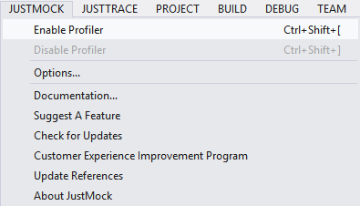

# Advanced Usage

There are a number of advanced (or elevated) testing scenarios that you can cover with Telerik® JustMock. Advanced testing scenarios include: 

* Mocking Sealed Classes
* Mocking Static Classes, Methods and Properties
* Mocking Final Methods and Properties
* Mocking Framework Methods (MsCorlib)
* Mocking Non-public Members and Types
* Mocking LINQ Queries

To cover these scenarios, JustMock uses the .NET Profiling API and provides integration tools with Visual Studio. You need to use the Enable and Disable commands from within the JustMock menu when you run unit tests that utilize the advanced scenarios.

JustMock supports what we call a dual architecture which basically covers the basic and the advanced(elevated) scenarios. In "basic mode" we support mocking interfaces, virtual and abstract methods and properties. While you mock those types you only need to reference the Telerik.JustMock.Dll in your project. In this mode keep JstMock disabled and let your unit tests run lighting fast.

When you need the advanced features, you need to go to "elevated mode", i.e. to enable JustMock from the menu. In this mode JustMock makes use of the .NET Profiling API with a specially designed dynamic proxy library optimized only for the mocking needs.

## How to Enable/Disable TelerikJustMock?

You only need to enable JustMock when you want to use the advanced features.

To enable/disable JustMock, go to the JustMock menu in Visual Studio and select Enable/Disable or use the shortcuts `Ctrl+Shift+[` and `Ctrl+Shift+]` to enable and disable, accordingly. 

**Figure 1: Enable/disable JustMock**

## How to Disable JustMock Programmatically?

If you are not using any of the Advanced features described in this section, you may want to ensure that JustMock is not using the profiler.

Here is a quick example:

{{region AdvancedFeatures#DisableProfiler}}
	[TestInitialize]
	public void Setup()
	{
	    Mock.DoNotUseProfiler();
	}
{{endregion}}
