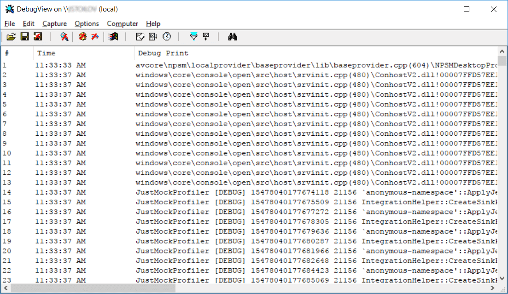

# Profiler Log And Trace

In this article you will get familiar with Telerik JustMock Profiler built-in log and trace capabilities. Elevated mocking is strongly relies on profiler and sometimes it might be blocked by unexpected behavior which is hard to be troubleshooted. Here comes the profiler trace, it is really useful for finding where the problem comes from.

## Enabling the Profiler Log And Trace
The log and trace functionality is controlled entirely via environment using dedicated variable __JUSTMOCK_LOG_LEVEL__. Possible values are: __TRACE__, __DEBUG__, __INFO__, __WARN__, __ERROR__, __CRITICAL__ and __OFF__. Values from __TRACE__ to __CRITICAL__ enable tracing with different verbosity level in descending order, while __OFF__ completely disables it. All traces are redirected to system debug output.

## Inspecting the Profiler traces
System debug could be visualized without debugger by using [DebugView](https://docs.microsoft.com/en-us/sysinternals/downloads/debugview). The typical output from the tool look like as following:



Keep in mind that the tool captures the output from whole system, so for convenience the traces could be filtered by the keyword __JustMockProfiler__.


> **Tip!**
>
>The traces inside DebugView window can be redirected to a file for further offline analysis.

Let's follow up an example, showing how the profiler trace can be enabled while executing test container from the command prompt step by step:

1. Setting up profiler trace level using environment variable

 ```
 set JUSTMOCK_LOG_LEVEL=DEBUG
 ```

2. Launch __DebugView__ and make sure that __'Capture Win32'__ and __'Capture Events'__ options are enabled


3. Setup filter in __DebugView__ with keyword __JustMockProfiler__

4. Launch test execution in elevated (advanced) mode. The easiest way to achieve that is to use __Telerik.JustMock.Console__

```
"C:\Program Files (x86)\Progress\Telerik JustMock\Libraries\Telerik.JustMock.Console.exe" --profiler-path-32="C:\Program Files (x86)\Progress\Telerik JustMock\Libraries\CodeWeaver\32\Telerik.CodeWeaver.Profiler.dll" --command="vstest.console.exe" --command-args="bin\Debug\net45\UnitTestProject.dll"
```

5. Profiler traces will start to appear inside __DebugView__ window