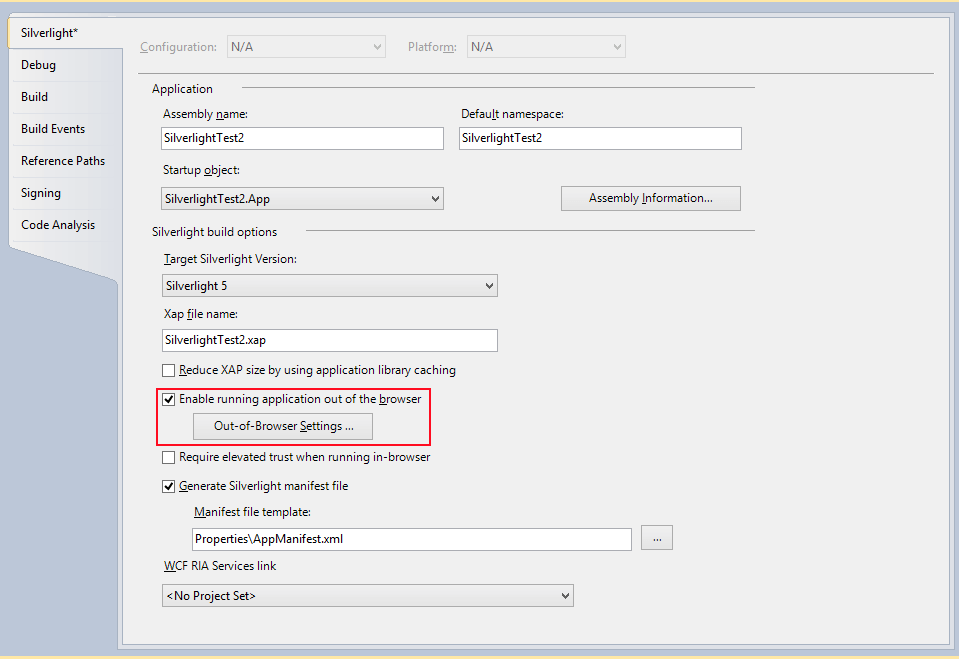
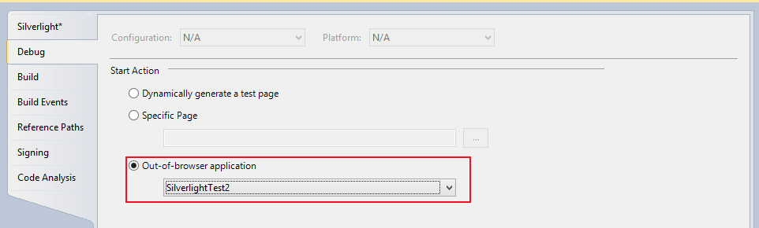

# Silverlight Mocking

__Telerik® JustMock__ enables you to mock classes/members from Silverlight assemblies. With JustMock you can mock almost everything (from interfaces, virtual and abstract methods and properties to sealed classes, non-virtual methods and properties, static classes, methods and properties, etc.) right within the Silverlight project.

As JustMock comes in two versions ([Commercial vs Free Version]()), there are also number of possible ways to apply mocking inside/to your Silverlight tests/assemblies:

## Mocking without Profiler inside Silverlight Projects

This approach is possible with both the free and commercial versions of JustMock.

In this mode you are able to mock only interfaces, virtual and abstract methods and properties. For this, you only need to refer the __Telerik.JustMock.Silverlight.dll__ (it can be found in the JustMock root folder, under "*Libraries*") from your Silverlight test project.

__Example: Arranging a void call that must be called__
  #### __[C#]__

  {{region SilverlightMocking#MockingWithProfilerDisabledTest1}}
    public interface IMyInterface
        {
            void DoSomething();
        }

        public class MyClass:IMyInterface
        {
            public void DoSomething()
            {
                throw new NotImplementedException();
            }
        }

        public class ClassUnderTest
        {
            private IMyInterface Dependency;

            public ClassUnderTest(IMyInterface interf)
            {
                this.Dependency = interf;
            }

            public void CallDoSomething()
            {
                Dependency.DoSomething();
            }
        }
        
        [TestMethod]
        public void ShouldMockVoidCall()
        {
            // Arrange
            var mockedInterface = Mock.Create<IMyInterface>();

            Mock.Arrange(() => mockedInterface.DoSomething()).DoNothing().MustBeCalled();

            // Act
            var myTestClass = new ClassUnderTest(mockedInterface);
            myTestClass.CallDoSomething();

            // Assert
            Mock.Assert(mockedInterface);
        }
  {{endregion}}

  #### __[VB]__

  {{region SilverlightMocking#MockingWithProfilerDisabledTest1}}
    Public Interface IMyInterface
        Sub DoSomething()
    End Interface

    Public Class [MyClass]
        Implements IMyInterface

        Public Sub DoSomething() Implements IMyInterface.DoSomething
            Throw New NotImplementedException()
        End Sub
    End Class

    Public Class ClassUnderTest
        Private Dependency As IMyInterface

        Public Sub New(interf As IMyInterface)
            Me.Dependency = interf
        End Sub

        Public Sub CallDoSomething()
            Dependency.DoSomething()
        End Sub
    End Class

    <TestMethod()> _
    Public Sub ShouldMockVoidCall()
        ' Arrange
        Dim mockedInterface = Mock.Create(Of IMyInterface)()

        Mock.Arrange(Sub() mockedInterface.DoSomething()).DoNothing().MustBeCalled()

        ' Act
        Dim myTestClass = New ClassUnderTest(mockedInterface)
        myTestClass.CallDoSomething()

        ' Assert
        Mock.Assert(mockedInterface)
    End Sub
  {{endregion}}

## Mocking with Enabled Profiler inside Silverlight Projects

> This is an Elevated Feature. Refer to [this]() topic to learn more about the differences between both the commercial and free versions of Telerik JustMock.

In this mode you are able to mock everything inside your Silverlight application, even sealed classes, non-virtual methods and properties, static classes, methods and properties and more.

> **Important**
>
> To use elevated mocking you first need to go to elevated mode by enabling JustMock from the menu. [How to Enable/Disable ](30af2f74-f30f-4e92-9668-64a7add42b63#EnableDisableJustMock)

We suggest to follow the next steps in order to set your Silverlight test project for elevated mocking: 

1.  Start by refering the "Telerik.JustMock.Silverlight" assembly to the test project. It can be found in the JustMock root folder, under "*Libraries*".
1.  Then, you will have to make some additional configurations to your test project. There are several options: 
	* *__(Recommended)__* Having your test project set as a startup project of the whole solution, we also recommend to enable its execution out of browser: 
	
	

	 If the above is completed, you might also need to set your test project start action to "*Out-of-browser application*": 
	

	*  If you don`t want to run your test application out of browser, then you will need to take additional steps to run the application in-browser. 
		*  __Internet Explorer 6__ - no additional steps necessary

		* __Internet Explorer 7 and above__ - *Protected Mode* must be disabled. Either disable it for the Internet security zone or run your test application in the Intranet security zone.

		* __Any other browser__ - you will have to manually terminate all browser instances right before test execution.

	*  Another option is to execute your test via the command prompt with the __JustMockRunner__, just as described [here](). 

3.  After everything is set, you can start writting elevated tests for your Silverlight application. 

__Example: Removing dependency with faking HtmlDocument__
  #### __[C#]__

  {{region SilverlightMocking#MockingWithProfilerEnabledTest1}}
    public class MyUsingHtmlDocumentClass
        {
            private HtmlDocument myHtmlDoc;

            public MyUsingHtmlDocumentClass(HtmlDocument doc)
            {
                this.myHtmlDoc = doc;
            }

            public string IsMyHtmlDocReady()
            {
                if (myHtmlDoc.IsReady)
                {
                    return "Document ready!";
                }
                return "Document NOT ready!";
            }
        }

        [TestMethod]
        public void ShouldFakeHtmlDocumentIsReady()
        {
            // Arrange
            var htmlDocumentFake = Mock.Create<HtmlDocument>();
            Mock.Arrange(() => htmlDocumentFake.IsReady).Returns(true);

            // Act
            var myTestClass = new MyUsingHtmlDocumentClass(htmlDocumentFake);
            var actualResult = myTestClass.IsMyHtmlDocReady();

            // Assert
            Assert.AreEqual("Document ready!", actualResult);
        }
  {{endregion}}

  #### __[VB]__

  {{region SilverlightMocking#MockingWithProfilerEnabledTest1}}
    Public Class MyUsingHtmlDocumentClass
        Private myHtmlDoc As HtmlDocument

        Public Sub New(doc As HtmlDocument)
            Me.myHtmlDoc = doc
        End Sub

        Public Function IsMyHtmlDocReady() As String
            If myHtmlDoc.IsReady Then
                Return "Document ready!"
            End If
            Return "Document NOT ready!"
        End Function
    End Class

    <TestMethod()> _
    Public Sub ShouldFakeHtmlDocumentIsReady()
        ' Arrange
        Dim htmlDocumentFake = Mock.Create(Of HtmlDocument)()
        Mock.Arrange(Function() htmlDocumentFake.IsReady).Returns(True)

        ' Act
        Dim myTestClass = New MyUsingHtmlDocumentClass(htmlDocumentFake)
        Dim actualResult = myTestClass.IsMyHtmlDocReady()

        ' Assert
        Assert.AreEqual("Document ready!", actualResult)
    End Sub
  {{endregion}}

__Example: Faking MsCorlib DateTime.Now property__
  #### __[C#]__

  {{region SilverlightMocking#MockingWithProfilerEnabledTest2}}
    [TestMethod]
        public void ShouldMockDateTimeNowInSilverlightProject()
        {
            // Arrange
            Mock.Arrange(()=>DateTime.Now).Returns(new DateTime(2000, 2, 20));

            // Act
            var actual = DateTime.Now;

            // Assert
            Assert.AreEqual(2000, actual.Year);
            Assert.AreEqual(2, actual.Month);
            Assert.AreEqual(20, actual.Day);
        }
  {{endregion}}

  #### __[VB]__

  {{region SilverlightMocking#MockingWithProfilerEnabledTest2}}
    <TestMethod()>
    Public Sub ShouldMockDateTimeNowInSilverlightProject()
        ' Arrange
        Mock.Arrange(Function() DateTime.Now).Returns(New DateTime(2000, 2, 20))

        ' Act
        Dim actual = DateTime.Now

        ' Assert
        Assert.AreEqual(2000, actual.Year)
        Assert.AreEqual(2, actual.Month)
        Assert.AreEqual(20, actual.Day)
    End Sub
  {{endregion}}

## Testing Silverlight Assemblies in Full .NET Projects

If your Silverlight application or class library is in a full .NET solution, you could easily test it with JustMock by following these steps:

1. Start by adding new "*JustMock Test Project*" to the solution. 					
1. Replace the existing references with their Silverlight versions.

	For example, "*System.DLL*" should be replaced with the "*System.DLL*", in most cases coming from "*C:\Program Files (x86)\Reference Assemblies\Microsoft\Framework\Silverlight\v5.0\System.dll*". 
	
	You can also replace the "*Microsoft.VisualStudio.QualityTools.UnitTestFramework*" with any other testing framework, like *NUnit* or *MbUnit*.
1. Further, you should add a reference to the Silverlight project, you will be testing.
1. Finally, you are ready to start writing unit tests against your Silverlight application or class library. 
