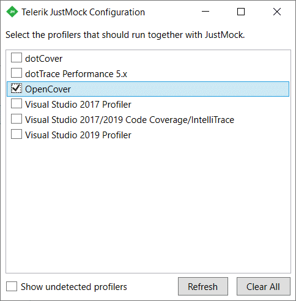
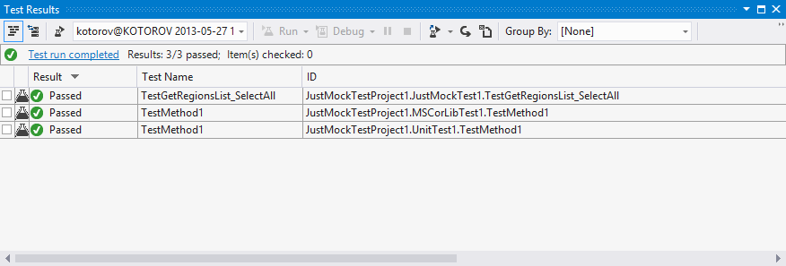

# OpenCover

__OpenCover__ is an open source code coverage tool for .NET 2 and above. __OpenCover__ is most commonly used to gather coverage data of code that is being exercised by unit testing (i.e. nunit, mstest etc.).

This article explains how to integrate Telerik® JustMock with __OpenCover__.

1. Start by registering the OpenCover profiler. Run cmd.exe as Administrator and execute the following lines:
	`regsvr32 "c:\Program Files (x86)\OpenCover\x64\OpenCover.Profiler.dll"`

	`regsvr32 "c:\Program Files (x86)\OpenCover\x86\OpenCover.Profiler.dll"`

	>You may need to change the paths in the commands above if OpenCover is deployed somewhere else on your machine.

1. Once the OpenCover.Profiler.dll is registered, link it with the JustMock profiler. How to link them is better described [here]().

	

1. Set the __JUSTMOCK_INSTANCE__ environment variable to __"1"__. Do this by inserting the following line in the previously opened command prompt:

	`SET JUSTMOCK_INSTANCE=1`

1. Collect the coverage data of your assemblies:

	For example:

	`"C:\Program Files (x86)\OpenCover\OpenCover.Console.exe" -mergebyhash –target:"C:\Program Files (x86)\Microsoft Visual Studio 11.0\Common7\IDE\MSTest.exe" -output:"coverage.xml" -targetargs:"/testcontainer:justmockTestproject1.dll"`

1. Continue by generating a coverage report (for example, using the ReportGenerator), and checking the test results. If everything is set up as described, your elevated JustMock tests must pass:

	

## See Also

 * [CodeCoverage Tools]()

 * [NCover]()
