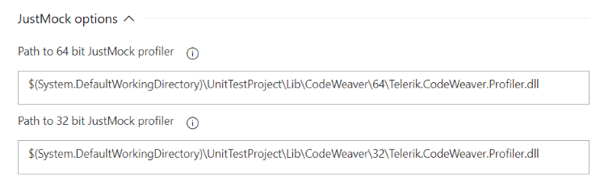

# Azure Devops Pipelines

The [Telerik JustMock Tests v.2](https://marketplace.visualstudio.com/items?itemName=vs-publisher-443.jm-vstest-2) extension is designed to deploy your JustMock test projects with minimal manual configurations for setting up your build environment.

It breaks you free from tedious configuration of environment variables and provides you simple options that can get you on the move in no time. In this topic we will focus on what are the required configuration steps when working with JustMock Tests v.2 extension.

## Suported Continuous Integration Environment

- Azure Devops Piplines
- TFS 2018 and all subsequent updates
- TFS 2017 Update 2 and all subsequent updates

## Steps for installing the JustMock Tests v.2 extension and the task

1. To install the extension go to the Azure DevOps marketplace and search for JustMock or click on this [link](https://marketplace.visualstudio.com/items?itemName=vs-publisher-443.jm-vstest-2).

2. Click on the "Get it free" button. The marketplace will require you to login if you haven't done that already.

    

3. Click on the install button and follow the procedure.

    

## Adding the Telerik JustMock VSTest v.2 to your build

Go to your build pipepile and click on the "Add task" button and find the "Telerik JustMock VSTest v.2" task located under the "Test" tab and click on the "Add" button of the task. As an alternative you could drag the task to the desired location in your build pipeline.

## Confuguring the Telerik JustMock VSTest v.2 task

The task is in essence a wrapper of the VSTest task and the configuration is the same. The only additional configuration is related to whether the build agent is hosted at the cloud or at on-premisses server.

### Using build agent hosted at the Azure DevOps cloud

For this scenario you have to configure the JustMock options in the "Telerik JustMock VSTest v.2 task". The options allow you to specify a relative path to the 32 and 64 bit JustMock Profiler. In this scenario the JustMock Profiler in his 32 and 64 bit variant should be included in your repository. The different variations are used in regards of whether the test execution process is 32 or 64 bit. By configuring both paths you will ensure that regardless of the bitness of the installation for .Net Framework or .Net Core the test execution process will be profiled and the JustMock advanced elevated features will be available.

### Using build agent hosted at on-premises server

For this scenario you have two possible variants to choose from.

1. The first variant is to configure the JustMock options in the "Telerik JustMock VSTest v.2 task" which is explained above. 

2. The second variant is to simply install JustMock at the on-premises server without the need of additional configuration.

## See Also

* [Cruise Control .NET]()

* [Jenkins CI]()

* [TeamCity]()