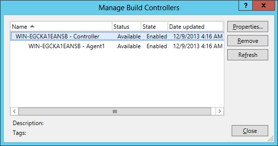

# TFS 2013

The JustMock Code Activity Workflow for Team Foundation Server 2013 is designed to deploy your JustMock test projects to TFS 2013 with zero manual configurations for setting up your build environment.

It breaks you free from tedious configuration of environment variables and provides you simple options that can get you on the move in no time. In this topic we will focus on what are the required configuration steps when working with JustMock Code Activity Workflow for TFS 2013.

> **Important**
>
>  Be sure, you have referred to the [ Integrating Telerik JustMock in TFS 2010 Code Activity Workflow ](/getting-started/installation-instructions#integrating-justmock-in-tfs-code-activity-workflow) before continuing with the steps below. 

## Steps for Integrating Justmock in New Build Configurations (TfvcTemplate.12.xaml)
1. First, you need to point the custom assemblies folder that contains the __Telerik.JustMock.Build.Workflow.VS2013__ DLL to your build controller.
	                
	> **Note**
	>
	> The DLL is included in the  __JustMock__  installation directory under the *Libraries*  folder.
	                  
	Do this by editing your build controller properties. Go to *Team Explorer*, then *Builds* and from the *Actions* menu select *Manage Build Controllers*. You will be prompted with a dialog similar to the one below:
	              
	**Manage Build Controllers: Select the controller and click**
	
	
	Then you have to set:
	* The "Version control path to custom assemblies"
	* The property to the location of the folder containing the __Telerik.JustMock.Build.Workflow.VS2013.dll__.
	
	**Build Controller Properties: Here we have set the Version control path to custom assemblies:**
	

1. Continue by customizing the __Default Template (TfvcTemplate.12.xaml)__ of your team project. If you are new to TFS, follow the next steps in order to download and access your build process template: 

	* Open your __Build Definition__ and navigate to the __Process__ tab.
	
	* Click the __Show details__ button in the __Build process template__ field and __Download__ the *Default Template (TfvcTemplate.12.xaml)*. You should save it somewhere in the current projects repository.
	                    
	* Then, add the downloaded precess template under *Source Control* in your project.
	                    
	
	* Open your __Build Definition__ again and in the __Process__ tab > __Build process template__ field, click __New..__
	
	* Browse the above build process template and select it as default to the project.
	                    
	* To edit the template, first check it out from *Source Control*.
	                    
	* Then, create new class library project (This will be a dummy project. Its only purpose is for editing the template. You don't need to add it to your solution or project collection) and refer the __Telerik.JustMock.Build.Workflow.VS2013.dll__.
	                    
	* Include the downloaded build process template in the class library project, using the *Add as Link* option.
	                    
	* Set its __Build Action__ to *None*.
	                    
	* For the changes to take effect, later on you will need to save the "dummy" project and check-in the build process template.
	                    
	Below is a screenshot of a section from the Default Template (TfvcTemplate.12.xaml):
	              
	**Default Template (TfvcTemplate.12.xaml) section: Inside the red square is the test execution activity.**
	
	
	You need to wrap the __Run VS Test Runner__ activity with the custom __JustMockStart/JustMockStop__ activities from the __Telerik.JustMock.Build.Workflow.VS2013.dll__.
	              
	
	In order to drag/drop the JustMock activities to your build template, you have to add the assembly into your *Toolbox* pane. Do this by opening *Tools* > *Choose Toolbox Items*. Then, select *Browse* and point to the __Telerik.JustMock.Build.Workflow.VS2013.dll__ in your custom assemblies folder (in this example: *$/JustMockActivityWorkflowProject/Addons*).
	              
	**Choose Toolbox Items: Inside the red square are the custom JustMockStart/JustMockStop activities.**
	
	
	After placing the JustMock activities, your template must look like this:
	                
	**Final Default Template (TfvcTemplate.12.xaml) section: The red arrows show where the custom JustMockStart/JustMockStop activities must be placed.**
	
	
	
	Optionally, set the LinkProfilers parameter on JustMockStart to link 3rd party profilers, for example "Visual Studio 2012 Code Coverage/IntelliTrace". Multiple profilers can be specified by separating them with a semicolon. The names of the profilers must be specified exactly as they appear in the UI of the JustMock configuration tool. The files __Telerik.JustMock.Configuration.exe__ and __Telerik.JustMock.Configuration.exe.config__ must be present in the same folder as Telerik.JustMock.Build.Workflow.VS2013.dll. To unlink profilers, set the UnlinkProfilers parameter on JustMockStop.
	              
	> **Important**
	>
	> Finally, save the "dummy" project and check-in the process template!
                
1. Once all is set, your JustMock tests that require profiler will work as expected.
    
	          
	**Green JustMock tests: In the red square you can see the JustMockStart activity for the certain process, the actual test execution and the JustMockStop activity for the same process.**
	

## Steps for Integrating Justmock in Updated Build Configurations (DefaultTemplate.11.1.xaml)

1. First, you need to point the custom assemblies folder that contains the __Telerik.JustMock.Build.Workflow.VS2013.dll__ to your build controller.
	                
	> **Note**
	>
	> The DLL is included in the  __JustMock__  installation directory under the *Libraries*  folder.
	                  
	Do this by editing your build controller properties. Go to *Team Explorer*, then *Builds* and from the *Actions* menu select *Manage Build Controllers*. You will be prompted with a dialog similar to the one below:
	              
	**Manage Build Controllers: Select the controller and click**
	
	
	Then you have to set: 
	* The "Version control path to custom assemblies"
	
	* The property to the location of the folder containing the __Telerik.JustMock.Build.Workflow.VS2013.dll__.
	              
	**Build Controller Properties: Here we have set the Version control path to custom assemblies:**
	

2. Continue by customizing the __DefaultTemplate.11.1.xaml__ you wish to update. Follow the next steps:	         
	* Start by adding the build precess template under *Source Control* in your project.
	                  
	* Then, open the __Build Definition__ and in the __Process__ tab > __Build process template__ field, click __New...__
	
	* Browse the above build process template and select it as default to the project.
	                  
	* To edit the template, first check it out from *Source Control*.
	                  
	* Then, create new class library project (This will be a dummy project. Its only purpose is for editing the template. You don't need to add it to your solution or project collection) and refer the __Telerik.JustMock.Build.Workflow.VS2013.dll__.
	                  
	* Include the downloaded build process template in the class library project, using the *Add as Link* option.
	                  
	* Set its __Build Action__ to *None*.
	                  
	* For the changes to take effect, later on you will need to save the "dummy" project and check-in the build process template.
	                  
	Below is a screenshot of a section from the Default Template (DefaultTemplate.11.1.xaml):
	              
	**DefaultTemplate.11.1.xaml): Inside the red square are the test execution activities.**
	
	
	You need to wrap the __Run Tests__ activity with the custom __JustMockStart/JustMockStop__ activities from the __Telerik.JustMock.Build.Workflow.VS2013.dll__.
	              
	In order to drag/drop the JustMock activities to your build template, you have to add the assembly into your *Toolbox* pane. Do this by opening *Tools* > *Choose Toolbox Items*. Then, select *Browse* and point to the __Telerik.JustMock.Build.Workflow.VS2013.dll__ in your custom assemblies folder (in this example: *$/JustMockActivityWorkflowProject/Addons*).
	              
	**Choose Toolbox Items: Inside the red square are the custom JustMockStart/JustMockStop activities.**
	
	
	After placing the JustMock activities, your template must look like this:
	                
	**Final Default Template (DefaultTemplate.11.1.xaml) section: The red arrows show where the custom JustMockStart/JustMockStop activities must be placed.**
	
	
	Optionally, set the LinkProfilers parameter on JustMockStart to link 3rd party profilers, for example "Visual Studio 2012 Code Coverage/IntelliTrace". Multiple profilers can be specified by separating them with a semicolon. The names of the profilers must be specified exactly as they appear in the UI of the JustMock configuration tool. The files __Telerik.JustMock.Configuration.exe__ and __Telerik.JustMock.Configuration.exe.config__ must be present in the same folder as Telerik.JustMock.Build.Workflow.VS2013.dll. To unlink profilers, set the UnlinkProfilers parameter on JustMockStop.
	              
	> **Important**
	>
	> Finally, save the "dummy" project and check-in the process template!
	                
3. Once all is set, your JustMock tests that require profiler will work as expected.
              
	**Green JustMock tests: In the red square you can see the JustMockStart activity for the certain process, the actual test execution and the JustMockStop activity for the same process.**
	

## See Also

 * [Cruise Control .NET]()

 * [Jenkins CI]()

 * [TeamCity]()
