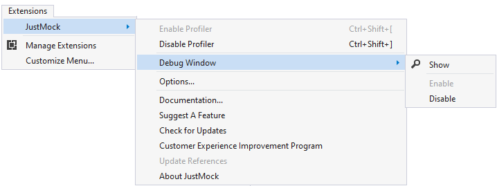
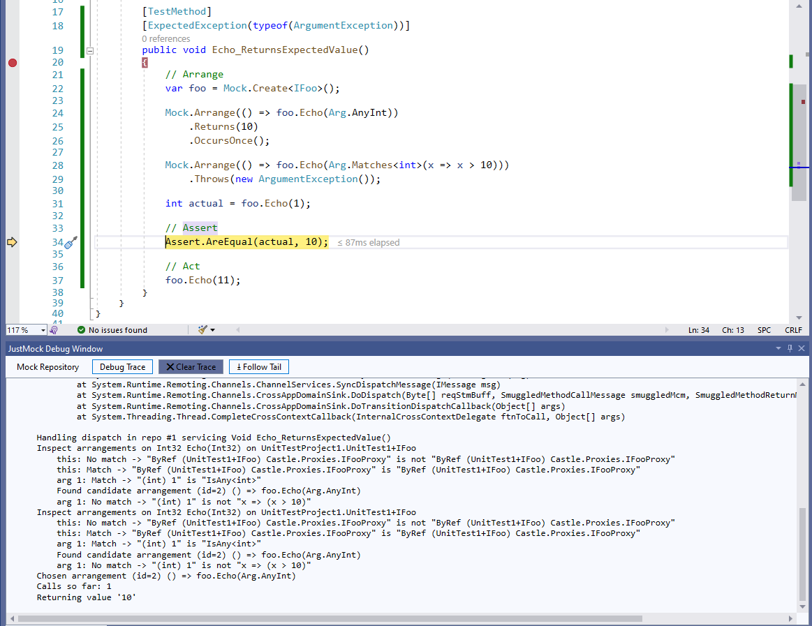
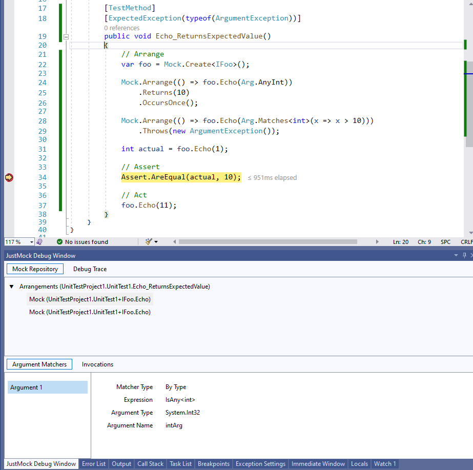
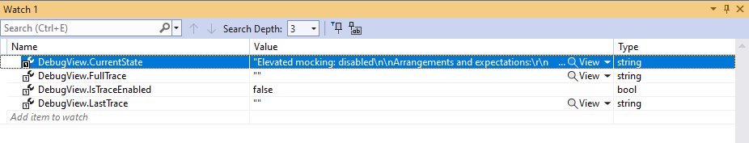
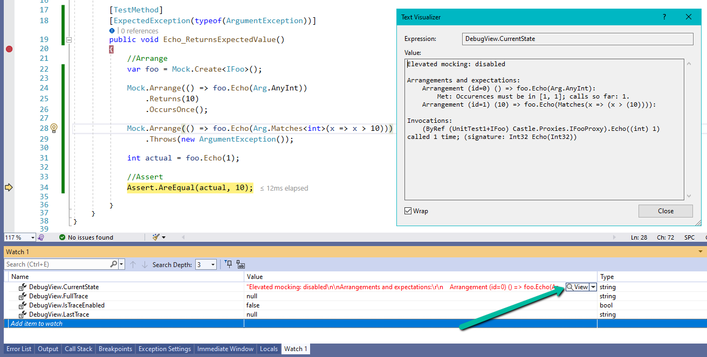
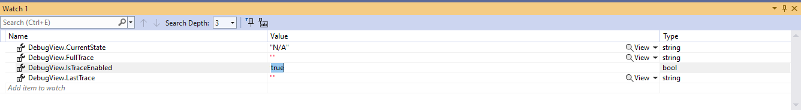
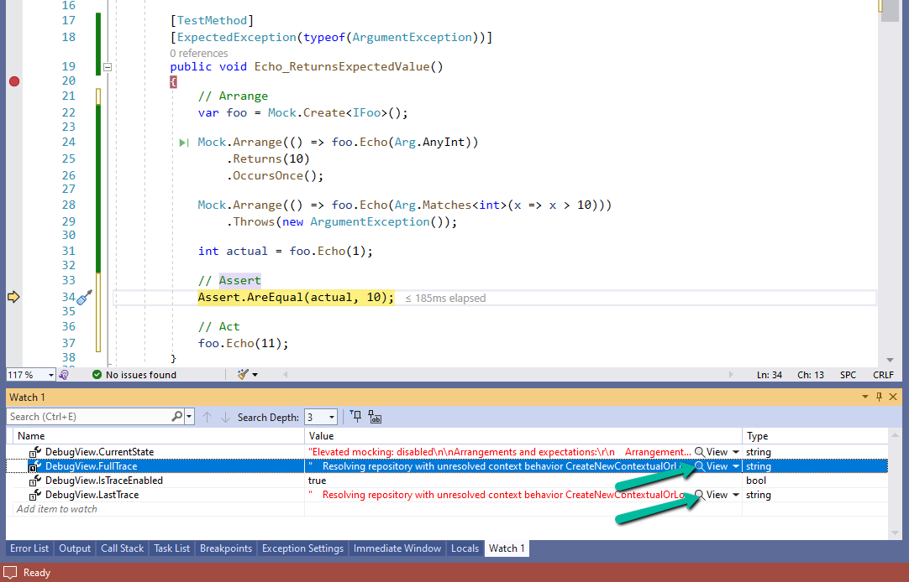
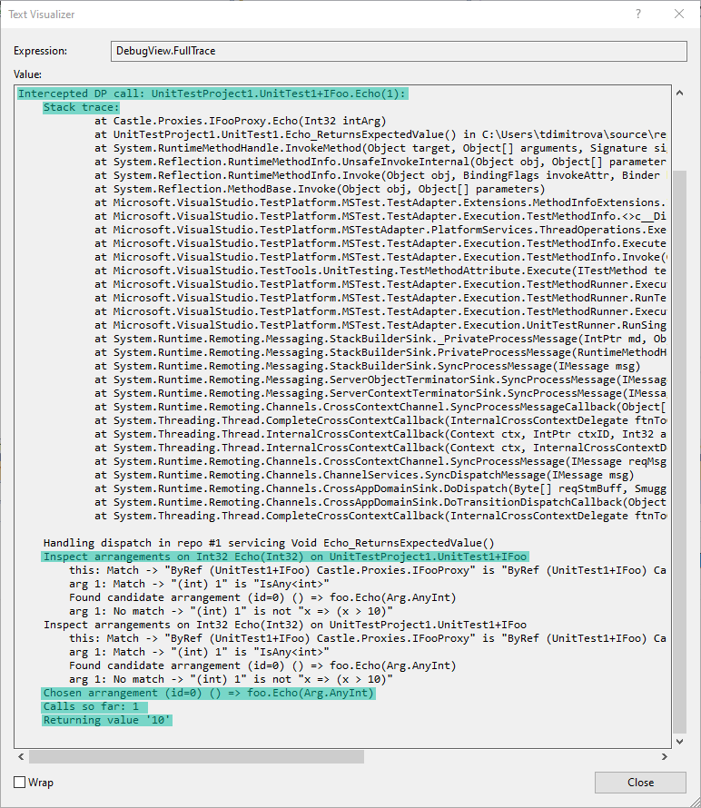

# Debugging Tests

JustMock comes with built-in __Debug View__ (API) and __Debug Window__ that are really useful when it comes to debugging tests and finding where the unexpected behavior comes from. This article covers the available functionalities and gives some good practices about where and what to look for in order to check the correctness of a certain test.

## Debug Window

JustMock extension for Visual Studio 2017 (and above) makes mock debugging even more convenient by adding tool window for visualizing trace messages and arranged method mocks. It can be opened from main menu __View > Other Windows > JustMock Debug Window__ or extension menu - __JustMock > Debug Window > Show__. There is also an option to enable or disable debug window by using the corresponding command in the extension menu.



> **Important**
>
>Enabling or disabling the debug window will be persisted and will be applied not only on the current instance of Visual Studio but also on all future ones.

The debug window consist of two panes which are active only while debugging:

* __Debug Trace__

This pane shows information about all the intercepted invocations in the test method. A sample output produced by sample unit test looks as following:



* __Mock Repository__

The pane shows basic information about particular method mock like name, declaring type and its invocations. The test method sample has the following repository view:




## Debug View

__Debug View__ is an API can be used only while debugging your test methods to provide you with more information about their execution. To enable it, place a breakpoint at the start of the inspected test and run the debugger. When the breakpoint is hit, open the Watch window and add the __Debug View__ by writing: *DebugView.[property_name]* under the Name column. The properties you can use are:

* __CurrentState__
* __FullTrace__
* __IsTraceEnabled__
* __LastTrace__

At first the fields will be empty. The information in them will be populated step by step, while debugging the test method.




### Inspecting the Current State

The __CurrentState__ field lists all of the arrangements that have been made during the test execution, all of the invocations and the elevated mocking state. This field will be updated accordingly after every new arrangement or invocation in the test method. You can use the text visualizer to inspect the __CurrentState__ as shown below:


In the Text Visualizer you will be able to see: 
* __Elevated mocking__ - Enabled or disabled depending if the JustMock profiler is turned on or off. 
* __Arrangements and expectations__ - Here you will find full list of all the arrangements made so far along with their expectations. 
* __Invocations__ - Shows all invocations with their arguments types and values. Another thing you can see is how many times certain invocation has been executed. 


### Tracing the Test Execution

Tracing your test method gives more details about the intercepted invocations order. The JustMock __Debug View__ gathers information about all intercepted calls. It shows their stack traces, matching arguments, the chosen arrangement, calls made so far and the return value (for functions). In addition, when tracing is enabled, the debugger prints the tracing log in the Output window.

To enable the tracing mode inside the __Debug View__, you must set the __IsTraceEnabled__ field to *true* at the beginning of the test method. This can be achieved by putting a breakpoint there and editing the value inside the Watch window.


Another option is to add: `DebugView.IsTraceEnabled = true;` as a first line of the test method. This will automatically enable the tracing option in debug mode.

#### [C#] Enable tracing in code
````
	[TestMethod]
	public void Echo_ReturnsExpectedValue()
	{
		DebugView.IsTraceEnabled = true;

		//Arrange 
		var foo = Mock.Create<IFoo>();

		Mock.Arrange(() => foo.Echo(Arg.AnyInt)).Returns(10);

		int actual = foo.Echo(1);

		//Assert 
		Assert.AreEqual(actual, 10);
	}
````

While tracing, you can operate with the rest two fields from the __Debug View__: 

* __FullTrace__ - Gives information about all the intercepted invocations in the test method. 
* __LastTrace__ - Gives information only about the last intercepted invocation in the test execution. 

Once again, you can use the text visualizer to inspect the information in the fields:


In the text visualizer you will be able to see the following information about each intercepted call: 

* __Stack trace__ - The full stack trace of the invocation. 
* __Matching arrangements on the particular call__ - All arrangements made for that member. 
* __Chosen arrangement__ - The applied arrangement in the test method. 
* __Number of calls__ - The number of calls made to that member. 
* __Return value (for functions only)__ - The return value of the function. 



As the logs can be rather long, you can copy them from the Visual Studio's Text Visualizer and paste them in another source code editor (Notepad++ for example). Then, changing the language to Python will provide the possibility of collapsing or expanding certain groups inside the log. Further, you will also get an appropriate syntax highlighting:


