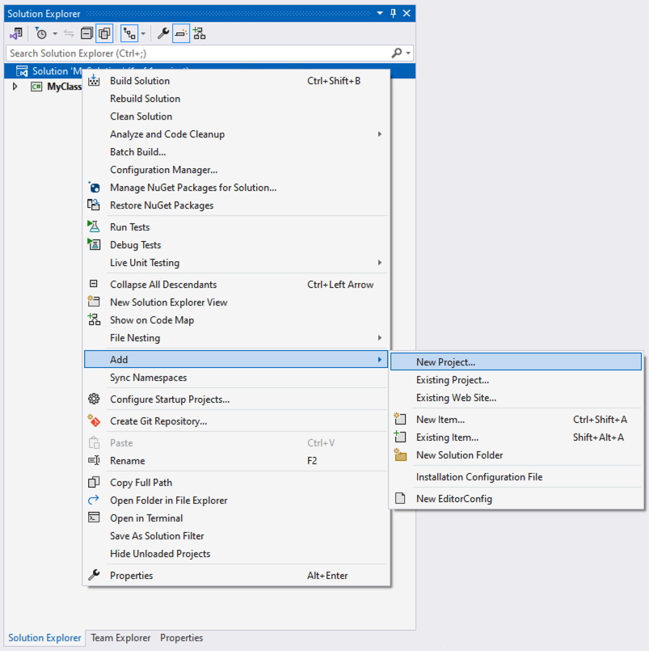
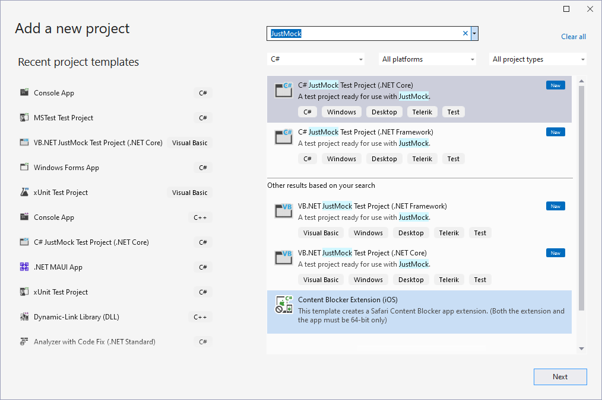
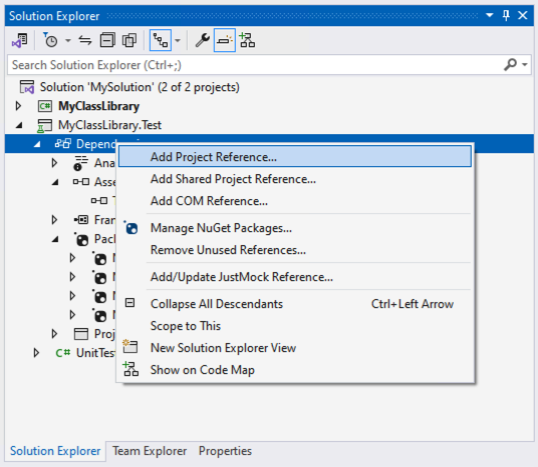
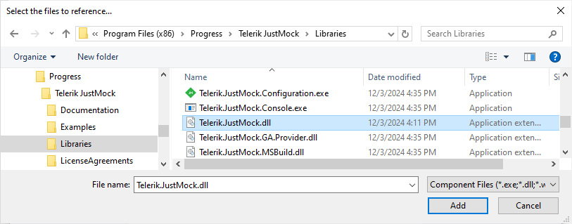
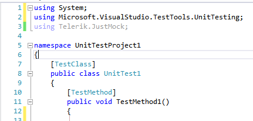
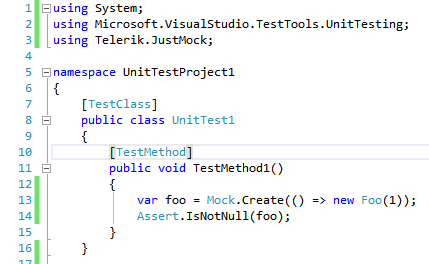

# Add Telerik JustMock to Test Project

This topic demonstrates how to use __JustMock__ in a new test project or integrate it in your existing project.

> **Important!**
>
> Before proceeding further, make sure you have successfully completed [Installation on Windows]().
    	
## Create New Project with JustMock Visual Studio Test Project Template

1. Start by adding a new test project to your Solution. Right click on the Solution, select Add, then New Project.... 

	

1. Select the Test Project template or search for it by typing `JustMock`. Once you have selected the desired template, click Next.

	

1. Using the default *JustMock Test Project* template, you can start writing JustMock tests right away. 
	
	> See an example how to use JustMock in [JustMock API Basics]()

## Add JustMock to an existing Visual Studio Test Project

If you want to use JustMock in an existing unit test project, you should add a reference to **Telerik.JustMock.dll**. 

1. Right click on your test project and select *Add Project Reference*.

	

1. Go to the *Browse* tab and navigate to the *Libraries* folder in the JustMock installation directory (by default *C:\Program Files (x86)\Progress\Telerik JustMock\Libraries*). Select __Telerik.JustMock.dll__ and click OK.
	
	> **Important!**
	>
	> For projects compatible with **.NET Standard 2.1**, the required assembly is located at *"C:\Program Files (x86)\Progress\Telerik JustMock\Libraries\netstandard2.1\"*

	

1. Further, you will need to include the *Telerik.JustMock* namespace into your test project.

	

1. Finally, you are ready to create your first test with JustMock.

	

	> **Tip!**
	>
	> As an altrernative you can use NuGet packages, check [Installation using NuGet package]() topic for details. 

## Next Steps

* [JustMock API Basics]()

## See Also

 * [JustMock API Basics]()

 * [Commercial vs Free Version](#commercial-vs-free-version)
