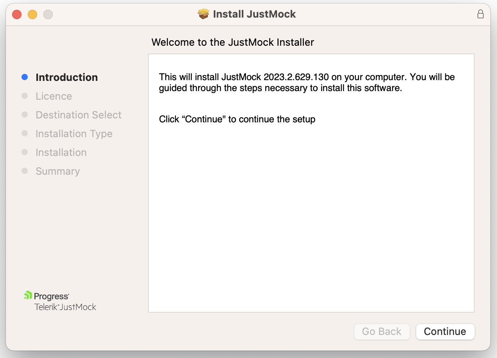
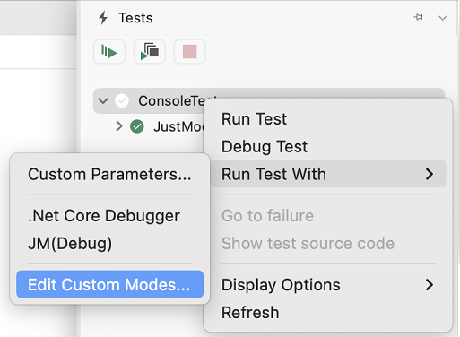
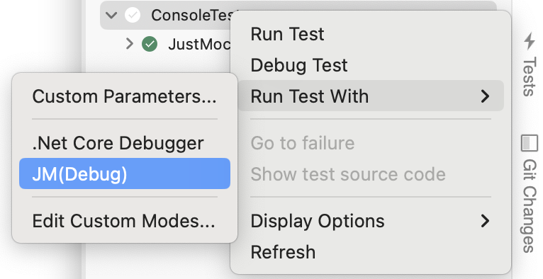

# Installation and Setup for Mac

This topic outlines how to install [Telerik JustMock](https://www.telerik.com/products/mocking.aspx) and configure Visual Studio on a Mac machine.

### Installing JustMock from Pkg File

1. Download the JustMock installer from www.telerik.com:
	* If this is your first time here and you want to try JustMock, download the trial installer file from here: [Download JustMock](https://www.telerik.com/account/downloads/product-download?product=JUSTMOCK). Keep in mind that this will require to either log in or create a new Telerik account.
	* Note that there are separate installers for x64 and arm64 platforms. Chose the one corresponding to your device system architecture.

1. Run the installer and follow the steps.

	

1. The installer will deploy JustMocks binaries to **'/Library/JustMock/'** folder.
1. Next steps are to configure your IDE.

>If you encounter issues during the installation process, submit a support ticket in our [support ticketing system](https://www.telerik.com/account/support-tickets) with as much details as possible and we will assist you. 

### Configure Visual Studio for Mac

To use the full spectrum of features you will need to set up Visual Studio for Mac to load JustMock profiler when tests are executed.

1. Open Visual Studio for Mac and create a unit test project.
1. Open **Tests** tab. Usually it is located in the right side panel bar.
1. Right-click the root node and open **Run Test With** > **Edit Custom Modes...** menu.

	

1. Click **Add** to create new mode.

    Configre **Execution Mode** to be __**.Net Core Debugger**__

    Add following **Environment Varibales**:

    |                          |   |
    |--------------------------|:--|
    | JUSTMOCK_INSTANCE        | 1 |
    | CORECLR_ENABLE_PROFILING | 1 |
    | CORECLR_PROFILER         | {B7ABE522-A68F-44F2-925B-81E7488E9EC0} |
    | CORECLR_PROFILER_PATH    | /Library/JustMock/**JM_VERSION**/Libraries/CodeWeaver/arm64/libTelerik.CodeWeaver.Profiler.dylib |

    **_NOTE:_** Replace **JM_VERSION** with JustMock version you have downloaded.

    Configure **Available for** to be __**All solutions**__

        

1. Now you can debug your test by running them with the newly created mode.
    

**_NOTE:_** If you want to run tests without debugger you can create similar mode as described above but set **Execution Mode** to __**Default**__.

## Resources and Documentation

- **Examples**

    The example projects provide a hands-on approach, unit testing JustMock itself. After installing JustMock, you can find the sample projects in the installation directory (by default C:\Program Files (x86)\Progress\Telerik JustMock). 

- **Offline Documentation**

    The documentation is also available in PDF format which you can download from your [Telerik account](https://www.telerik.com/account/my-downloads).

- **Additional Assistance**

    If you need additional assistance, take a look at our [online JustMock forums](https://www.telerik.com/forums/justmock) or [contact support](https://www.telerik.com/account/support-tickets?pid=743).

- **Suggestions and Reports**

    If you want to suggest a new feature or vote for a popular one, please visit [JustMock Feedback Portal](https://feedback.telerik.com/justmock).

## Next Steps

* [JustMock API Basics]()
