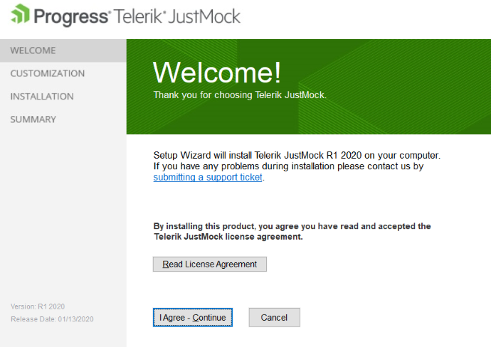
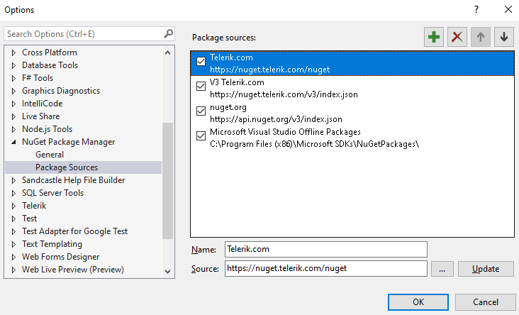
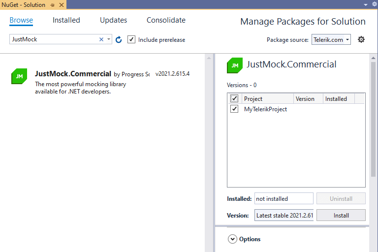
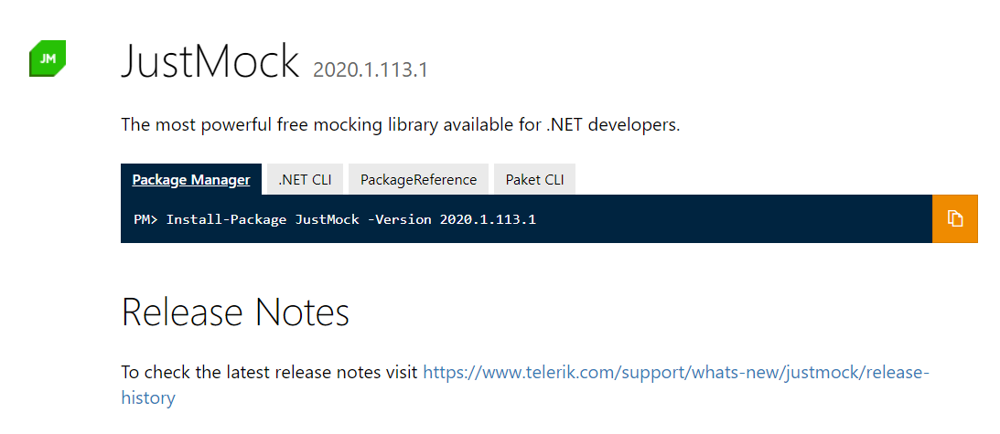

# Installation and Setup

This topic outlines the steps required to install [Telerik JustMock](https://www.telerik.com/products/mocking.aspx) and [Telerik JustMock Lite](https://www.telerik.com/justmock/free-mocking).

## Installing JustMock

JustMock offers two installation methods&mdash;[using the MSI](#installing-justmock-from-msi-file) and using the [NuGet package](#installing-justmock-from-nuget-package).

### Installing JustMock from MSI File

1. Download the JustMock installer from www.telerik.com:
	* If this is your first time here and you want to try JustMock, download the trial installer file from here: [Download JustMock](https://www.telerik.com/download-trial-file/v2-b/justmock-b). Keep in mind that this will require to either log in or create a new Telerik account.
	* If you are a licensed JustMock user, log in your Telerik account and navigate to the [Downloads section](https://www.telerik.com/account/my-downloads).

1. Run the installer and follow the steps. Configure the default installation folder. 

	

1. You are all set.

>If you encounter issues during the installation process, submit a support ticket in our [support ticketing system](https://www.telerik.com/account/support-tickets) with as much details as possible and we will assist you. 

### Installing JustMock from NuGet Package

To install the JustMock NuGet package, first add the Telerik NuGet server to the Visual Studio NuGet Package Manager:

1. Open Visual Studio and go to **Tools** > **NuGet Package Manager** > **Package Manager Settings**.

1. Select **Package Sources**, and then select the **+** button.

1. In the **Name** field, enter `Telerik.com`.

1. In the **Source** field, enter `https://nuget.telerik.com/v3/index.json`, and then select **OK**.

    > The improved Telerik NuGet v3 is now available at https://nuget.telerik.com/v3/index.json. The new v3 API is faster, lighter, and reduces the number of requests from NuGet clients. The old https://nuget.telerik.com/nuget server will be deprecated and we encourage our clients to switch to the v3 API and use https://nuget.telerik.com/v3/index.json to access it.

    

Once you have configured Visual Studio to access the Telerik NuGet server, add the JustMock NuGet package to the project:

1. In Visual Studio, open the solution in which you will use mocking.

1. Go to **Tools** > **NuGet Package Manager** > **Manage NuGet Packages for Solution...**.

1. From the **Package source** drop-down, select `Telerik.com`.

1. On the **Browse** tab, search for `JustMock`.

1. Select the `JustMock.Commercial` package, select the desired project, and then select **Install**.

    

## Installing JustMock Lite

You can choose between the following approaches:

* __JustMock Lite__ is available from [www.nuget.org](https://www.nuget.org/). You can use the nuget package manager console from within Visual Studio to install JustMock Lite. The command for installing JustMock Lite can be found on this page: [https://nuget.org/List/Packages/JustMock](https://nuget.org/List/Packages/JustMock).

	

* You can download the __JustMock Lite__ installer from [JustMock Lite: Free Mocking Framework](https://www.telerik.com/justmock/free-mocking) page.  Keep in mind that this will require to either log in or create a new Telerik account.

## Resources and Documentation

- **Examples**

    The example projects provide a hands-on approach, unit testing JustMock itself. After installing JustMock, you can find the sample projects in the installation directory (by default C:\Program Files (x86)\Progress\Telerik JustMock). 

- **Offline Documentation**

    The documentation is also available in PDF format which you can download from your [Telerik account](https://www.telerik.com/account/my-downloads).

- **Additional Assistance**

    If you need additional assistance, take a look at our [online JustMock forums](https://www.telerik.com/forums/justmock) or [contact support](https://www.telerik.com/account/support-tickets?pid=743).

- **Suggestions and Reports**

    If you want to suggest a new feature or vote for a popular one, please visit [JustMock Feedback Portal](https://feedback.telerik.com/justmock).

## Next Steps

* [Add Telerik JustMock to Your Test Project]()
* [JustMock API Basics]()

## See Also

 * [Add Telerik JustMock to Your Test Project]()

 * [Visual Studio Extension]()

 * [Commercial vs Free Version]()
