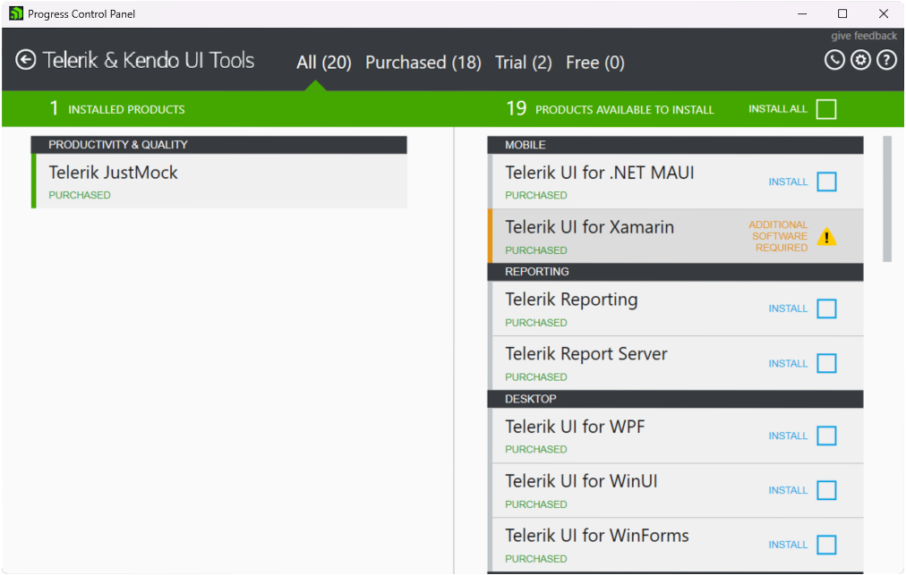

# Installation using Progress Control Panel

Progress Control Panel is a standalone desktop application for Windows that enables developers to install, monitor, and manage their Telerik products. In addition, the Control Panel automates the NuGet package source and sets up license keys for all Telerik product

To install Telerik JustMock by using the Progress Control Panel:

1. [Download](https://www.telerik.com/try/control-panel) the Progress Control Panel.

1. Run the downloaded application and log in with your Telerik account.

1. Select Telerik JustMock and, if desired, any other products for installation.

For more information and detailed installation and configuration instructions, see the [Progress Control Panel documentation](https://docs.telerik.com/controlpanel/introduction).

    
## See Also

 * [Visual Studio Extension]()
 * [Commercial vs Free Version]()