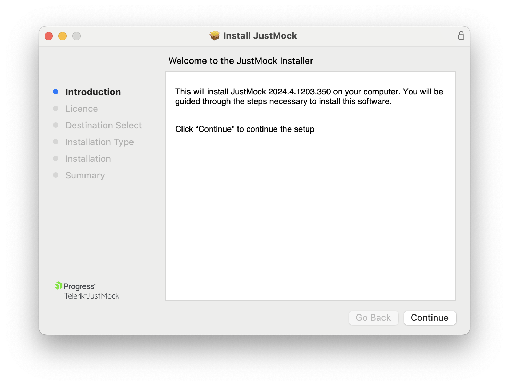

# Installation on macOS

This topic outlines how to install [Telerik JustMock](https://www.telerik.com/products/mocking.aspx) on a macOS.

### Installing JustMock

1. Download the JustMock installer from www.telerik.com:
	* Keep in mind that this will require you to either log in or create a new Telerik account.
	* Note that there are separate installers for x64 and arm64 platforms. Choose the one corresponding to your device system architecture.

1. Run the installer and follow the steps.

	

    By default the installer deploys JustMocks binaries to `/Library/JustMock/[VERSION]` folder.

1. You are all set.

>If you encounter issues during the installation process, submit a support ticket in our [support ticketing system](https://www.telerik.com/account/support-tickets) with as much details as possible and we will assist you. 

## Resources and Documentation

- **Offline Documentation**

    The documentation is also available in PDF format which you can download from your [Telerik account](https://www.telerik.com/account/my-downloads).

- **Additional Assistance**

    If you need additional assistance, take a look at our [online JustMock forums](https://www.telerik.com/forums/justmock) or [contact support](https://www.telerik.com/account/support-tickets?pid=743).

- **Suggestions and Reports**

    If you want to suggest a new feature or vote for a popular one, please visit [JustMock Feedback Portal](https://feedback.telerik.com/justmock).

## Next Steps

* [Add Telerik JustMock to Your Test Project]()
* [JustMock API Basics]()
