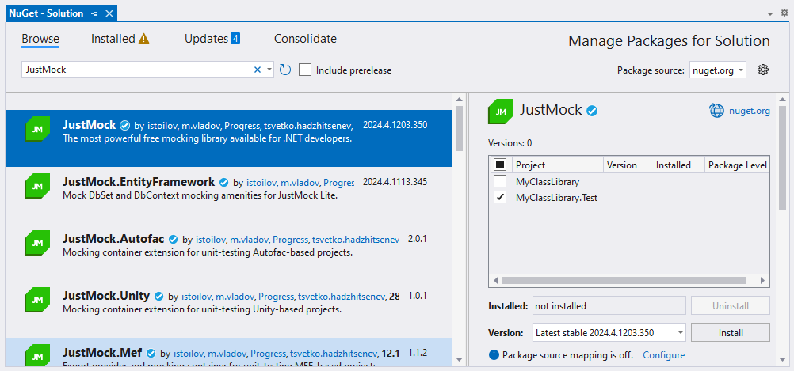

# Installation using NuGet package

This topic outlines the steps required to install [Telerik JustMock](https://www.telerik.com/products/mocking.aspx) and [Telerik JustMock Lite](https://www.telerik.com/justmock/free-mocking) using the NuGet package inside Visual Studio or on the command line.

## Installing JustMock

#### Visual Studio

To install the JustMock NuGet package, first add the Telerik NuGet feed to the package sources using NuGet Package Manager:

1. Open Visual Studio and go to **Tools** > **NuGet Package Manager** > **Package Manager Settings**.

1. Select **Package Sources**, and then select the **+** button.

1. In the **Name** field, enter `Telerik.com`.

1. In the **Source** field, enter `https://nuget.telerik.com/v3/index.json`, and then select **OK**.

    > The Telerik NuGet feed is available for authorized access at https://nuget.telerik.com/v3/index.json. Note that the previous v2 server, accessible at https://nuget.telerik.com/nuget, is deprecated and is no longer in use.

    

Once you have configured Visual Studio to access the Telerik NuGet server, add the JustMock NuGet package to the project:

1. In Visual Studio, open the solution in which you will use mocking.

1. Go to **Tools** > **NuGet Package Manager** > **Manage NuGet Packages for Solution...**.

1. From the **Package source** drop-down, select `Telerik.com`.

1. On the **Browse** tab, search for `JustMock`.

1. Select the `JustMock.Commercial` package, select the desired project, and then select **Install**.

    

#### Command Line

- On the command line you can use the following commands:

```bat
dotnet nuget add source "https://nuget.telerik.com/v3/index.json" --name "Telerik.com" --username <TELERIK_USER> --password <TELERIK_PASS>
dotnet add package JustMock.Commercial --version 2024.4.1203.350
```

> Telerik NuGet feed can be used with NuGet API keys, check this [article](https://docs.telerik.com/kendo-ui/intro/installation/nuget-keys) to learn more.

## Installing JustMock Lite

#### Visual Studio

- JustMock Lite NuGet package is available on [nuget.org](https://www.nuget.org/). You can follow similar steps from the second part of the procedure above to add the JustMock Lite package to your test project in Visual Studio. Simply select the `nuget.org` source and browse for the JustMock Lite package:

    

#### Command Line

- On the command line run the following command:

    ```bat
    dotnet add package JustMock --version 2024.4.1203.350
    ```

## Resources and Documentation

- **Offline Documentation**

    The documentation is also available in PDF format which you can download from your [Telerik account](https://www.telerik.com/account/my-downloads).

- **Additional Assistance**

    If you need additional assistance, take a look at our [online JustMock forums](https://www.telerik.com/forums/justmock) or [contact support](https://www.telerik.com/account/support-tickets?pid=743).

- **Suggestions and Reports**

    If you want to suggest a new feature or vote for a popular one, please visit [JustMock Feedback Portal](https://feedback.telerik.com/justmock).

## Next Steps

* [Add Telerik JustMock to Your Test Project]()
* [JustMock API Basics]()
