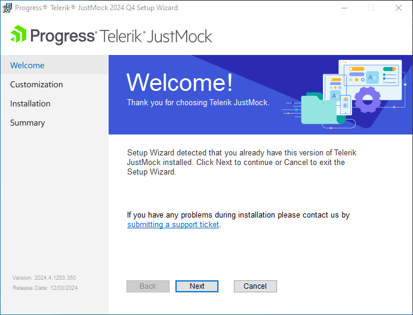

# Installation on Windows

This topic outlines the steps required to install [Telerik JustMock](https://www.telerik.com/products/mocking.aspx) and [Telerik JustMock Lite](https://www.telerik.com/justmock/free-mocking) on Windows.

### Installing JustMock

1. Download the JustMock installer from www.telerik.com:
	* If this is your first time here and you want to try JustMock, download the installer file from here: [Download JustMock](https://www.telerik.com/download-trial-file/v2-b/justmock-b). Keep in mind that this will require to either log in or create a new Telerik account.
	* If you are a licensed JustMock user, log in your Telerik account and navigate to the [Downloads section](https://www.telerik.com/account/my-downloads).

1. Run the installer and follow the steps. 

	

    By default the installer deploys JustMocks binaries to `C:\Program Files (x86)\Progress\Telerik JustMock` folder.

1. You are all set.

>If you encounter issues during the installation process, submit a support ticket in our [support ticketing system](https://www.telerik.com/account/support-tickets) with as much details as possible and we will assist you. 

## Installing JustMock Lite

- The __JustMock Lite__ installer is available at [JustMock Lite: Free Mocking Framework](https://www.telerik.com/justmock/free-mocking) page. Note that this will require logging in or creating a new Telerik account.

## Resources and Documentation

- **Examples**

    The example projects provide a hands-on approach, unit testing JustMock itself. After installing JustMock, you can find the sample projects in the installation directory (by default `C:\Program Files (x86)\Progress\Telerik JustMock\Examples`).

- **Offline Documentation**

    The documentation is also available in PDF format which you can download from your [Telerik account](https://www.telerik.com/account/my-downloads).

- **Additional Assistance**

    If you need additional assistance, take a look at our [online JustMock forums](https://www.telerik.com/forums/justmock) or [contact support](https://www.telerik.com/account/support-tickets?pid=743).

- **Suggestions and Reports**

    If you want to suggest a new feature or vote for a popular one, please visit [JustMock Feedback Portal](https://feedback.telerik.com/justmock).

## Next Steps

* [Add Telerik JustMock to Your Test Project]()
* [JustMock API Basics]()

## See Also

 * [Visual Studio Extension]()
 * [Commercial vs Free Version](#commercial-vs-free-version)
