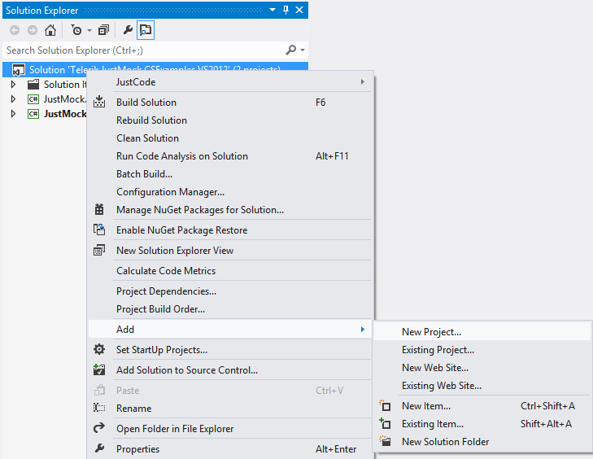
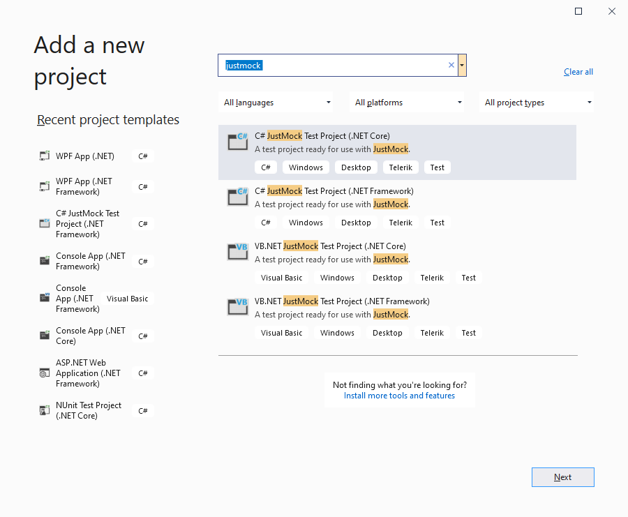
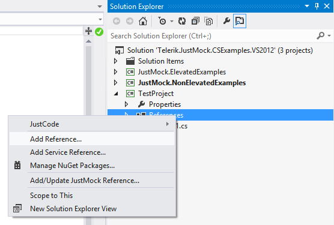
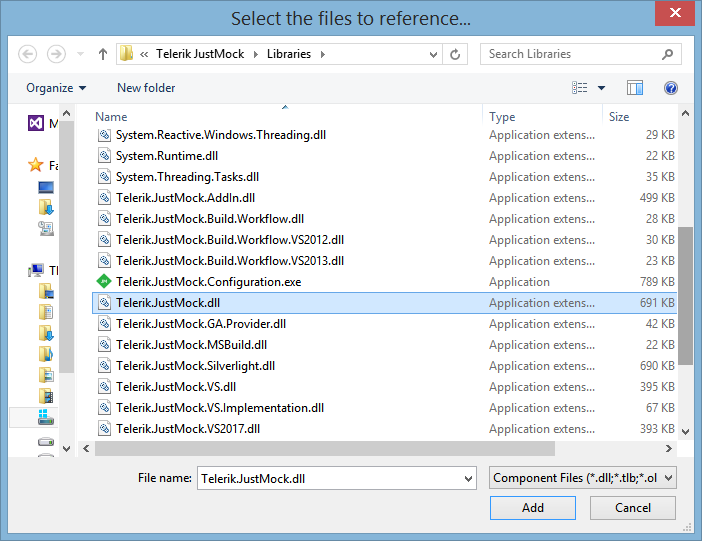
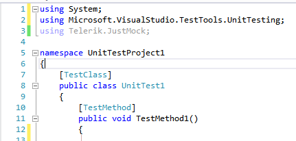
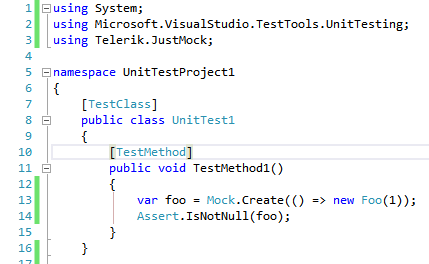

# Add Telerik JustMock to Your Test Project

This topic demonstrates how to use __Telerik® JustMock__ in a new test project or integrate it in your existing project.

>Before proceeding further, make sure you have successfully completed [Installation and Setup]().

    	
## Create New Project with JustMock Test Project Template

1. Start by adding a new test project to your Solution. Right click on the Solution, select Add, then New Project.... 

	**Figure 1: Add new project**  
	

1. Select the Test Project template. Enter a Name and click OK.

	**Figure 2: Choose the JustMock Test Project template**  
	

1. Using the default *JustMock Test Project* template, you can start writing JustMock tests right away. 
	
	>tip See an example how to use JustMock in [JustMock API Basics]()

## Add JustMock to a Test Project

If you want to apply JustMock to an existing unit test project, you need to add a reference to Telerik.JustMock.Dll. 

1. Right click on your test project and select Add Reference.

	**Figure 3: Add reference to a project**  
	

1. Go to the Browse tab and navigate to the Libraries folder in the JustMock installation directory (by default C:\Program Files (x86)\Progress\Telerik JustMock\Libraries). Select __Telerik.JustMock.dll__ and click OK.

	**Figure 4: Select Telerik.JustMock.dll reference**  
	

1. Further, you will need to include the *Telerik.JustMock* namespace into your test project.

	**Figure 5: Include TelerikJustMockNamespace namespace**  
	

1. Finally, you are ready to create your first test with JustMock.

	**Figure 6: Write your first test**  
	
	
## Next Steps

* [JustMock API Basics]()
* [Test Your Application with JustMock]()

## See Also

 * [JustMock API Basics]()

 * [Commercial vs Free Version]()
