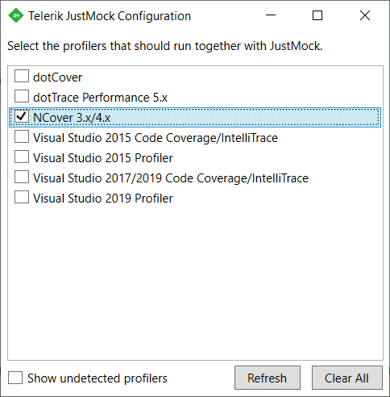
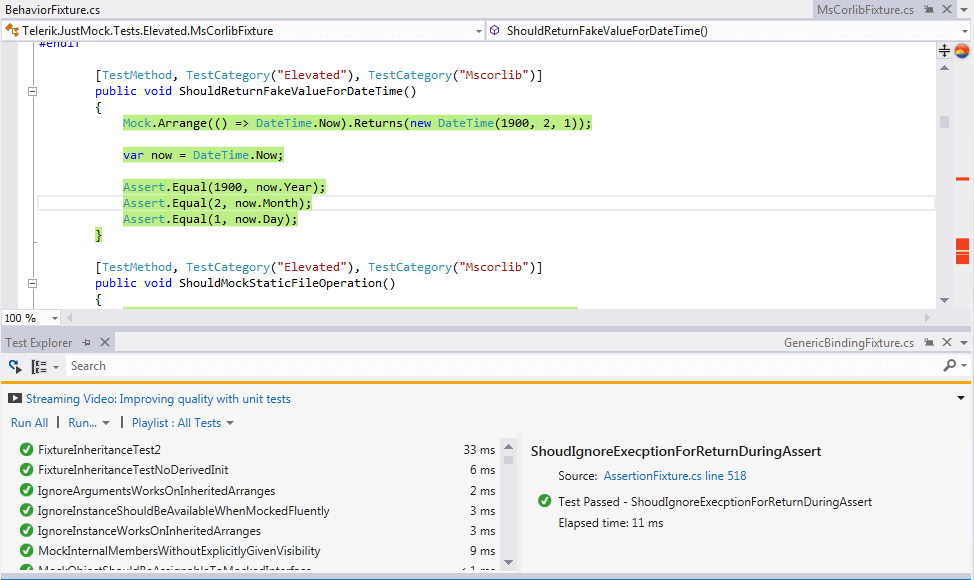

# NCover

__NCover Desktop__ is a .NET code coverage tool.

This article explains how to link the __Telerik® JustMock__ and __NCover__ profilers and have passing unit tests with collected code coverage.

## Configuring NCover

> You must install NCover with global profiling __turned off__. Otherwise, you will not be able to integrate it with the TelerikJustMock profiler.__
> 
> For more details, follow this link: [https://www.ncover.com/support/docs/extras/command-line/set-install-dir](https://www.ncover.com/support/docs/extras/command-line/set-install-dir). 

## Linking JustMock and NCover Profilers

To use __NCover__ along with the JustMock profiler, you will need to:

1. Configure your NCover project:

	* [MSTest](https://www.ncover.com/support/docs/v4/user-guide/desktop/coverage_scenarios/how_do_i_collect_data_from_mstest) (this points to an article from the NCover web site) 
	* [NUnit](https://www.ncover.com/support/docs/v4/user-guide/desktop/coverage_scenarios/how_do_i_collect_data_from_nunit) (this points to an article from the NCover web site)

1. Register the NCover profiler.
                
	Run an elevated Command Prompt (cmd.exe as administrator). Navigate to the NCover install folder(by default: *C:\Program Files\NCover v4 Desktop\*) and execute the following line:
	
	__ncover use --reg__

1. Link the profilers *(depending on the NCover version you are using)* from the JustMock Configuration tool:

	
	
	This process is better described [here]().
              
1. Set the __JUSTMOCK_INSTANCE__ environment variable to __"1"__.

	Do this by inserting the following line in the previously opened command prompt:

	`SET JUSTMOCK_INSTANCE=1`

1. Then, you will be able to collect the coverage data of your assemblies.

	*For example:*

	`ncover run --project=proj -- "c:\Program Files (x86)\Microsoft Visual Studio 11.0\Common7\IDE\MSTest.exe" /testcontainer:"C:\Program Files (x86)\Telerik\JustMock\Examples\CSExamples\JustMock.ElevatedExamples\bin\Debug\JustMock.ElevatedExamples.dll"`

	JustMock elevated tests should pass now:

	

1. Finally, check if coverage has been collected for your assemblies.

	

> **Note**
>
> To successfully unlink both profilers, you will need to:
>
> 1. Unlink both profilers, as shown [here]().
> 1. Unregister the NCover profiler with executing the following line in the command prompt: *ncover use --unreg* 

## Visual Studio Integration

Having the profilers linked must be enough for using both JustMock and NCover inside Visual Studio:

## See Also

 * [Code Coverage Tools]()

