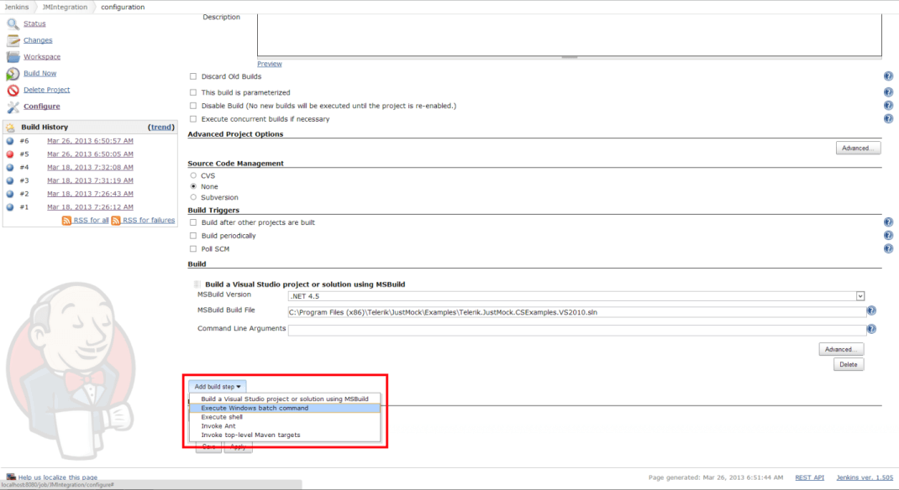
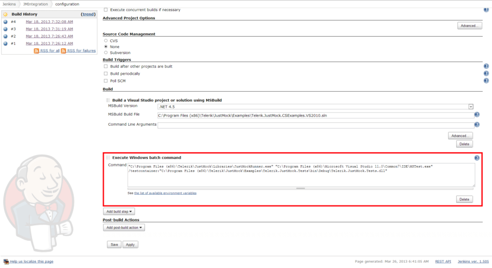

# Jenkins CI

In this article we will show you how to integrate __Telerik JustMock__ with __Jenkins-CI__.

## Integrating JustMock within Jenkins CI using MS Build Tasks

The first possible way to integrate TelerikJustMock with the __Jenkins CI__ process is by using JustMock [MSBuild Tasks](). This could be appropriate if you have predefined XML for your build process to follow.

## Integrating JustMock within Jenkins CI using Windows Batch Command

Another approach for integrating TelerikJustMock with __Jenkins__ is provided by the __Execute Windows batch command__ build step in the __Jenkins__ job configuration. To see how to execute __JustMock__ test DLLs via the __Command Prompt__, refer to [Windows Batch Command]().

Below you will find steps to follow for running JustMock test DLLs in the Jenkins build process:

1.  Start by adding __Execute Windows batch command__ build step into your configuration. 

	

1.  Having this, you are now able to configure it to execute test DLLs via the __cmd.exe__ as shown in [Windows Batch Command](). 

	

	You will simply need to pass an appropriate test execution command through the __JustMockRunner.exe__, which will configure the rest of the environment automatically.
 
	For example: * "C:\Program Files (x86)\Telerik\JustMock\Libraries\JustMockRunner.exe" "C:\Program Files (x86)\Microsoft Visual Studio 11.0\Common7\IDE\MSTest.exe" /testcontainer:"C:\Program Files (x86)\Telerik\JustMock\Examples\Telerik.JustMock.Tests\bin\Debug\Telerik.JustMock.Tests.dll" *

## See Also

 * [TFS 2010]()

 * [Cruise Control .NET]()

 * [TeamCity]()

 * [Windows Batch Command]()
