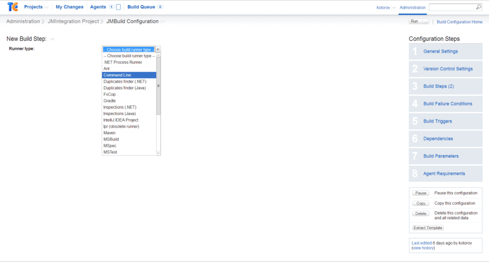
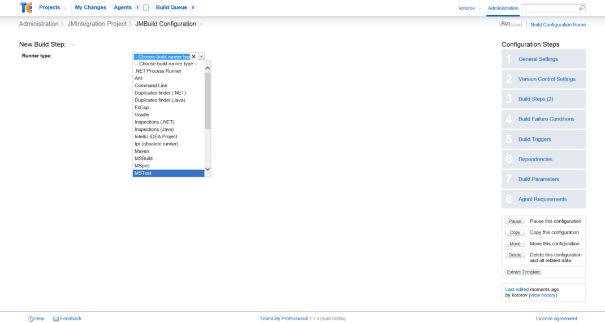
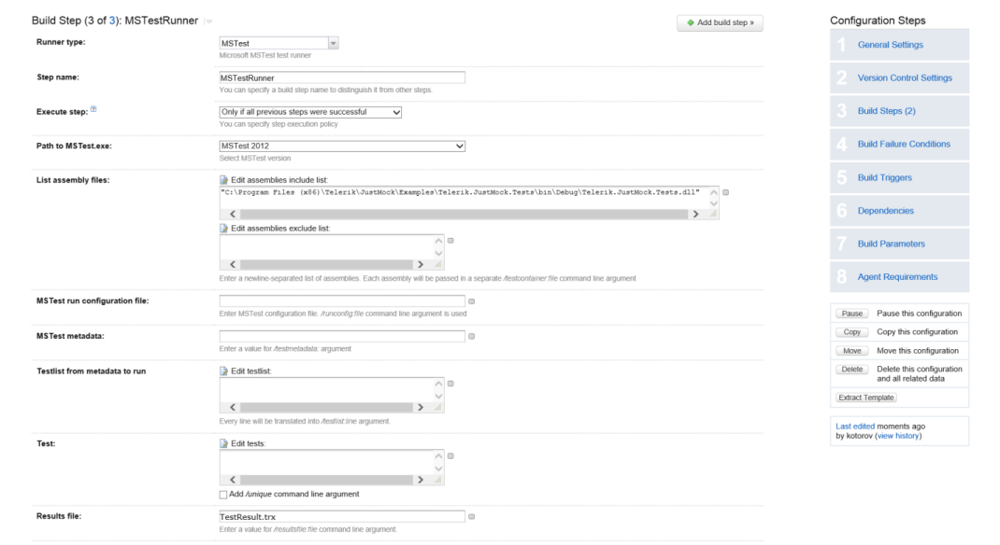
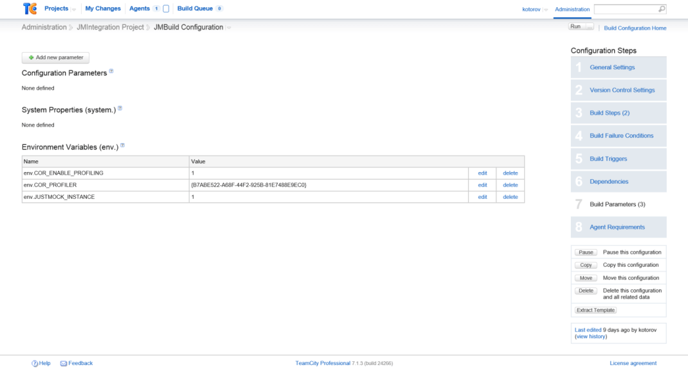
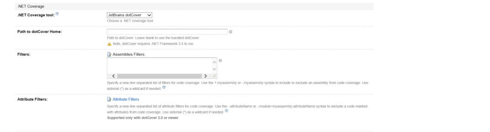

# TeamCity

In this article we will show you how to integrate Telerik JustMock with __TeamCity__.

## Integrating JustMock within TeamCity using MS Build Tasks

The first possible way to integrate TelerikJustMock with __TeamCity__ is by using JustMock [MSBuild Tasks](). This could be appropriate if you have predefined XML for your build process to follow.

## Integrating JustMock within TeamCity using Windows Batch Command

Another approach for integrating TelerikJustMock with __TeamCity__ is provided by the __"Command Line" runner type__ build step in the project build configuration. To see how to execute __JustMock__ test DLLs via the __Command Prompt__, refer to [Windows Batch Command]().

Below you will find steps to follow for running JustMock test DLLs in the TeamCity build process:

1. Start by adding new build step with runner type: __Command Line__ to your configuration.
	

1. Having this, you are now able to configure it to execute test DLLs via the __cmd.exe__ as shown in [Windows Batch Command]().

	

	You will simply need to pass an appropriate test execution command through the __JustMockRunner.exe__, which will configure the rest of the environment automatically.

	For example:
	```
	"C:\Program Files (x86)\Telerik\JustMock\Libraries\JustMockRunner.exe" "C:\Program Files (x86)\Microsoft Visual Studio 11.0\Common7\IDE\MSTest.exe" /testcontainer:"C:\Program Files (x86)\Telerik\JustMock\Examples\Telerik.JustMock.Tests\bin\Debug\Telerik.JustMock.Tests.dll"
	```


## Integrating JustMock within TeamCity using MS Test or NUnit build steps

It is also possible to achieve execution of JustMock tests with the MSTest/NUnit build step that comes from __TeamCity__.

1. First you will need to create the build step:

	

1. Configure its parameters:

	

1. The only difference is that, to run elevated tests with JustMock, you will need to have its profiler enabled for the build process. This can be achieved, by setting the JustMock environment variables as build parameters:

	__Configuration steps__

	* Open "Build Parameters".
	* Click "Add new parameter".
	* As a kind, select "Environment variable (env.)". 
	* One by one, add the following variables:
		`JUSTMOCK_INSTANCE=1`
		`COR_ENABLE_PROFILING=1`
		`COR_PROFILER={B7ABE522-A68F-44F2-925B-81E7488E9EC0}`

	


## Integrating JustMock within TeamCity using MS Test or NUnit build steps with dotCover

If you want to apply code coverage inside MSTest/NUnit build step, you will need to link the profilers first, as shown [here]().
        	

> **Note**
>
> If you are using the  __dotCover__  shipped with  __TeamCity__ , you will need to create a build project and run it, to see the dotCover option in  __JustMock Configuration__ . 


1. Configure the MSTest/NUnit build step and add ".NET Coverage tool":
	

1. Then link the profilers using the "Telerik JustMock Configuration". This is better explained [here]().
	

1. Finally you will need to set *JUSTMOCK_INSTANCE=1* as environment variable in the "Build Parameters" of your project:
	

## See Also

 * [TFS 2010]()

 * [CodeCoverage Tools]()

 * [Cruise Control .NET]()

 * [Jenkins CI]()

 * [MSBuild Tasks]()

 * [Windows Batch Command]()
