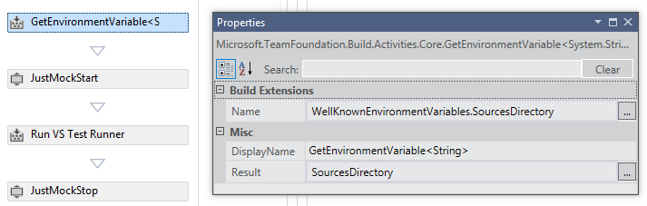

# Installation-Free Elevated Mocking

We recommend that you install __Telerik® JustMock__ on every machine that needs to enable the profiler for elevated mocking. However, we also know that this is not always possible. For example, you may want to run your builds on a shared hosting build server, which doesn't allow installation of third party software. In those cases, you can configure JustMock to activate the profiler without prior installation.

## Prerequisites and Caveats

.NET Framework 4 and up allow you to activate a profiler without it being installed in the registry beforehand. To do this, you need to specify the __full__ path to the profiler DLL to the .NET runtime. Note that this has to be done before starting the profiled process.

There are limitations to using registry-free profiler activation: 

* You can't use it with .NET 2.0/3.5 test runners - only .NET 4 and newer are supported.
* You must know the bitness of the test runner beforehand. If the test runner is a 32-bit process, then you must specify the path to the 32-bit profiler DLL. If the test runner is 64-bit, then you need to use the 64-bit profiler DLL.

After you choose the required bitness of the profiler, you must commit the respective profiler DLLs into your source control repository. You can find the profiler DLLs in the JustMock installation folder. The usual locations are:

* __32-bit profiler__ - C:\Program Files (x86)\Progress\Telerik JustMock\Libraries\CodeWeaver\32\Telerik.CodeWeaver.Profiler.dll
* __64-bit profiler__ - C:\Program Files (x86)\Progress\Telerik JustMock\Libraries\CodeWeaver\32\Telerik.CodeWeaver.Profiler.dll

Commit one or both DLLs to your source control repository. __Do not rename them!__ If you need to use both, then commit them in separate folders. Your build system can then activate the profiler after checking it out from source control. The need to specify the full path to the profiler DLL means that you need to have a mechanism to resolve relative paths in source control to physical paths before trying to activate the profiler.

## Installation-Free Integration with MSBuild

The `<JustMockStart/>` MSBuild task has the attribute __ProfilerPath__, which must be set to the full path to the profiler DLL. Usually there is a build variable that holds the absolute path to the source code root folder. If we assume that variable is called $(SourceDir) then we can set the profiler path like so:
            
  {{region }}
    <JustMockStart ProfilerPath="$(SourceDir)\path\to\Telerik.CodeWeaver.Profiler.dll" />
  {{endregion}}

## Installation-Free Integration with TFS Workflow Code Activities

Before proceeding with the steps to enable installation-free integration with TFS, you must first execute the steps for integrating the JustMock Code Activity into your build workflow. Follow [this article]() for detailed steps describing the Code Activity Workflow for TFS 2010 or TFS 2012, or check [this page]() to integrate TelerikJustMock in TFS 2013.

The __JustMockStart__ Code Activity has the __ProfilerPath__ property, which must be set to the full path to the profiler DLL. Usually there is a build variable that holds the absolute path to the source code root folder. If we assume that variable is called *SourcesDirectory* then we can set the profiler path like so:

If you don't have a variable that holds the path to the sources, then you can create one by following these steps.

1. Create a build variable called *SourcesDirectory* as shown on the following diagram:

	
	
	It should be of type String and scoped to "Compile, Test and Publish".

1. When asked, specify String for the type of its generic argument:

	

1. Configure the activity:

	

	* Set the Name property to *WellKnownEnvironmentVariables.SourcesDirectory*
	* Set the Result property to *SourcesDirectory*

## Installation-Free Integration through the Environment

Installation-free integration in the general case by setting the `COR_PROFILER_PATH` environment variable to the full path to the profiler DLL.

Execute the following shell command before executing JustMockRunner.exe or otherwise executing the command that runs the tests:

`SET COR_PROFILER_PATH=C:\full\path\to\Telerik.CodeWeaver.Profiler.dll`

Substitute the path to the correct path. How you do that depends on the specific build system you're integrating with.
