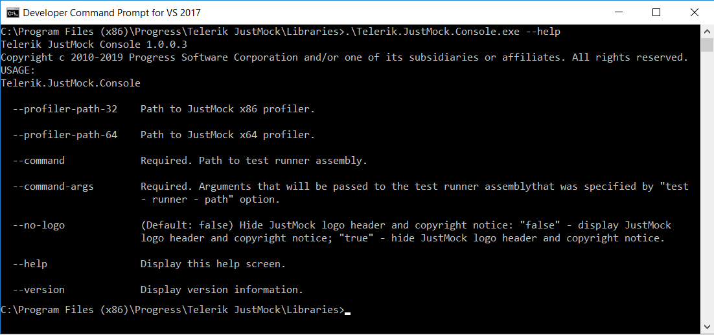

# JustMock Console

The **JustMockConsole** comes in hady for executing **installation-free** elevated mocking tests extending the functionality of **JustMockRunner**. Those of you who are familiar using **JustMockRunner** will easily get used to **JustMockConsole**.

With **JustMockConsole** it is easy to execute **.NET Framework** and/or **.NET Core** tests. The tool is shipped with JustMock installation and can be located in the following folder:

```C:\Program Files (x86)\Progress\Telerik JustMock\Libraries```

To get a feeling about the functionality of the command line tool you may execute:

```Telerik.JustMock.Console –help```

A sample output from running the above command may look like following:




Note that the command line options on the screenshot are part of **runadvanced** verb. The current version of **JustMockConsole** contains just a single verb that can be omitted, but we strongly advice to actually **include the verb** when using **JustMockConsole**. This way it will be far easier to adopt new versions of **JustMockConsole**, that may have more verbs and functionality.

##  How to run profiler enabled JustMock tests in command prompt

Running advanced JustMock tests is achieved by specifying proper values for **—command** and **—command-args** options. 

Below is example usage of JustMockConsole with VSTestConsole:

```Telerik.JustMock.Console runadvanced --command "\"C:\full\path\to\vstest.console.exe\"" --command-args "\"C:\full\path\to\JustMock.Tests.dll\""```

Another sample may use .NET Core **dotnet** tool like following:

```Telerik.JustMock.Console runadvanced --command "dotnet" --command-args "exec \"C:\full\path\to\dotnet\vstest.console.dll\" --Framework:\".NETCoreApp,Version=v2.0\" "C:\full\path\to\JustMock.Tests.dll\""```


##  How to run installation free profiling with JustMockConsole

In order to perform installation free profiling you need to provide values for **—profiler-path-32**  and/or **—profiler-path-64** command line options like demonstrated in the following example:

```Telerik.JustMock.Console --profiler-path-64 "\"C:\Program Files (x86)\Progress\Telerik JustMock\Libraries\CodeWeaver\64\Telerik.CodeWeaver.Profiler.dll\"" --command "\"C:\full\path\to\vstest.console.exe\"" --command-args "\"C:\full\path\to\JustMock.Tests.dll\""```

Note that it is possible to mix 32 and 64 bit profiling by specifying both command options like:

```Telerik.JustMock.Console --profiler-path-32 "\"C:\Program Files (x86)\Progress\Telerik JustMock\Libraries\CodeWeaver\32\Telerik.CodeWeaver.Profiler.dll\"" --profiler-path-64 "\"C:\Program Files (x86)\Progress\Telerik JustMock\Libraries\CodeWeaver\64\Telerik.CodeWeaver.Profiler.dll\"" --command "\"C:\full\path\to\vstest.console.exe\"" --command-args "\"C:\full\path\to\JustMock.Tests.dll\""```
