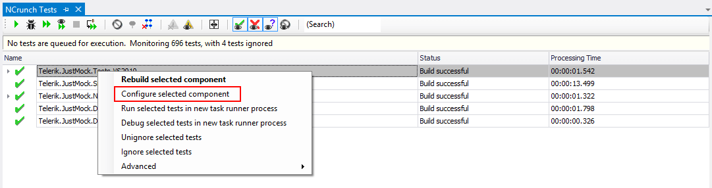
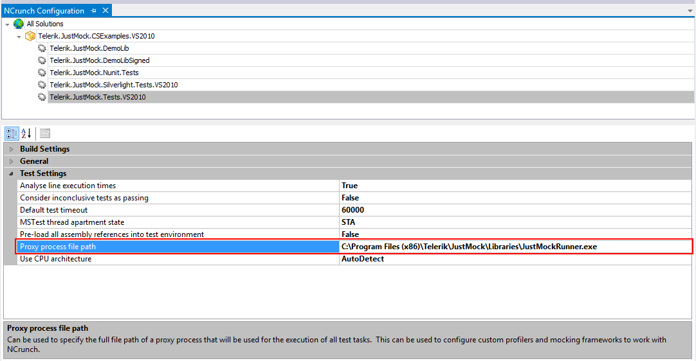

# NCrunch

__NCrunch__ is an automated testing tool for __Microsoft Visual Studio__. It has an automated test runner, and gives information about the tested code, such as code coverage and performance metrics.

This article explains how to integrate Telerik JustMock with __NCrunch__ inside Visual Studio.

## Configuring NCrunch

JustMock supports all of the listed options from the NCrunch Configuration Wizard. This means, __you will be able to execute your tests in parallel and decide whether to optimizing your test execution or memory efficiency__.

## Setting up NCrunch for Running Elevated JustMock Tests

> This feature is available only in the commercial version of Telerik JustMock. Refer to [this]() topic to learn more about the differences between the commercial and free versions.

> **Important**
>
> To use elevated mocking you first need to go to elevated mode by enabling TelerikJustMock from the menu. Learn how to do that in the [How to Enable/Disable Telerik JustMock](../advanced-usage/advanced-usage#how-to-enabledisable-telerik-justmock) topic.

To use __NCrunch__ along with the JustMock profiler, you will need to: 

1. Show the NCrunch configuration window for your test assembly. You could right click the test assembly from the NCrunch Tests window and select *Configure selected component*:

	

1.  Then, navigate to *Test Settings* and point the exact location of the __JustMockRunner__ (by default: *C:\Program Files (x86)\Telerik\JustMock\Libraries\JustMockRunner.exe*) for "*Proxy process file path*", as shown below:

	

1.  Save the solution, rebuild and enjoy the integration between both JustMock and NCrunch. 
