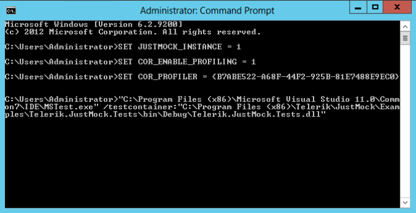
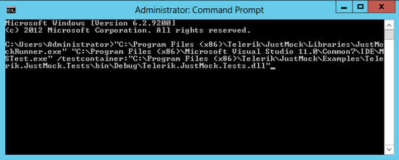

# Command Line

You can execute test DLLs via the __Command Prompt(cmd.exe)__. No matter of whether you have installed JustMock on a specific environment or not, you can run your elevated tests in a console. This article describes how you can run tests in cmd.exe with JustMock installation.

>If you would like to run elevated tests **without installing JustMock**, make sure to set the required environment variables for registering the profiler before proceeding with the current topic. The variables you should set are listed in the [General Integration]() topic.

## Run Profiler-Enabled JustMock Tests in Command Line

The procedure of executing test DLLs in __Command Line__ is almost identical regardless of the different unit testing frameworks that you may use.

To operate, JustMock needs to have specific variables registered in the environment. To prepare your environment, you should set the __JustMock environment variables__. That can be done using one of the following approaches:

### With JustMock Console
    
The **JustMock Console** automatically prepares the environment so you can directly execute your tests and it is **the suggested approach** for running tests in console. For detailed instructions on how to use it, check the [JustMock Console]() topic.

### Manually

If for any reason using __JustMock Console__ does not apply to your case, it is possible to set the __JustMock environment variables__ manually before running the tests. 

>All the needed variables and the values you should pass to them are described in the [General Integration]() topic.

Once the environment variables are set, you will be able to run elevated JustMock tests through the __Command Prompt__, simply by following the standard steps for the chosen unit testing framework. The next example shows setting up the environment and running tests using VS 2019.

Execution command for VS 2019: 

`"C:\Program Files (x86)\Microsoft Visual Studio\2019\Enterprise\Common7\IDE\CommonExtensions\Microsoft\TestWindow\vstest.console.exe" "C:\Program Files (x86)\Progress\Telerik JustMock\Examples\CSExamples\JustMock.ElevatedExamples\bin\Debug\JustMock.ElevatedExamples.dll"`

### With JustMock Runner

>important**JustMock Runner** is outdated and the section is for backward compatibility only.

__JustMock Runner__ will automatically setup an appropriate environment for the product so you don't need to do any additional settings. 

__JustMockRunner.exe__ can be found in the JustMock installation directory under the Libraries folder (by default *C:\Program Files (x86)\Progress\Telerik JustMock\Libraries*). 

 Below you will find an example batch file, that will use __MSTest__ to run all the tests in JustMock.ElevatedExamples.dll (found in the *Examples\CSExamples* folder inside Telerik JustMock root folder). 

 Execution command for VS 2019: 

`"C:\Program Files (x86)\Progress\Telerik JustMock\Libraries\JustMockRunner.exe" "C:\Program Files (x86)\Microsoft Visual Studio\2019\Preview\Common7\IDE\MSTest.exe" /testcontainer:"C:\Program Files (x86)\Progress\Telerik JustMock\Examples\CSExamples\JustMock.ElevatedExamples\bin\Debug\JustMock.ElevatedExamples.dll"`