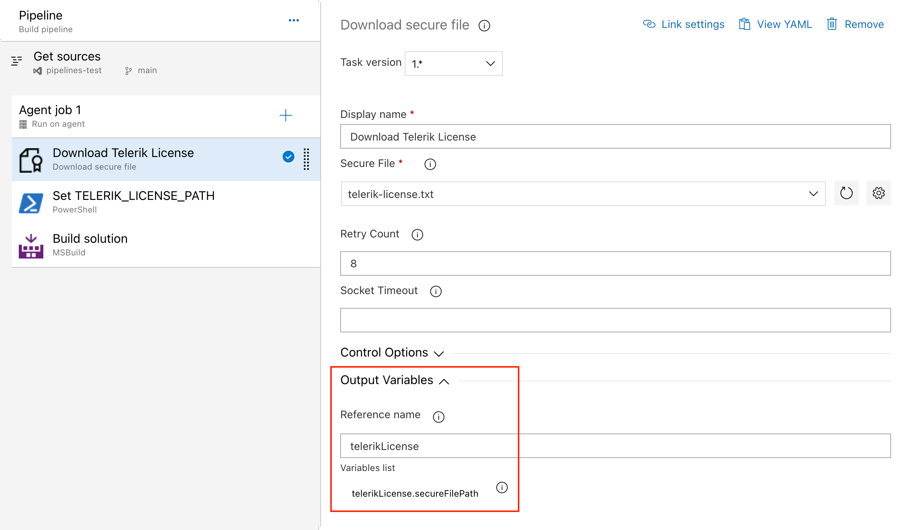
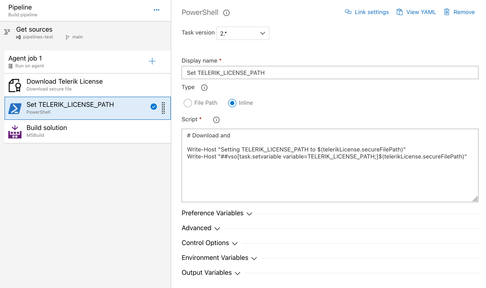

# Adding Your License Key to CI/CD Services

This article describes how to set up and activate your Telerik JustMock [license key]() across popular CI/CD services.

The license activation process in a CI/CD environment involves the following steps:

1. [Download]() a license key from your Telerik account.

1. [Create an environment variable](#creating-an-environment-variable) named `TELERIK_LICENSE` and add your Telerik JustMock license key as a value.

## Creating an Environment Variable

The recommended approach for providing your license key is to use environment variables. Each CI/CD platform has a different process for setting environment variables and this article lists only some of the most popular examples.

### Azure Pipelines

1. Create a new [user-defined variable](https://docs.microsoft.com/en-us/azure/devops/pipelines/process/variables?view=azure-devops&tabs=yaml%2Cbatch#user-defined-variables) named `TELERIK_LICENSE`.

1. Paste the contents of the license key file as a value.

> If your CI/CD service is not listed in this article, contact the Telerik technical support.

### GitHub Actions

1. Create a new [Repository Secret](https://docs.github.com/en/actions/reference/encrypted-secrets#creating-encrypted-secrets-for-a-repository) or an [Organization Secret](https://docs.github.com/en/actions/reference/encrypted-secrets#creating-encrypted-secrets-for-an-organization).

1. Set the name of the secret to `TELERIK_LICENSE` and paste the contents of the license file as a value.

1. Update the build step that executes the tests. For example, in a GitHub Actions workflow, you can include the following step in your YAML configuration:

```yaml
- name: Run Tests with Telerik JustMock
    env:
        TELERIK_LICENSE: ${{ secrets.TELERIK_LICENSE }}
    run: |
        # Your test execution command goes here
```

### Azure Pipelines

1. Create a new [secret variable](https://learn.microsoft.com/en-us/azure/devops/pipelines/process/variables?view=azure-devops&tabs=yaml%2Cbatch#secret-variables) named `TELERIK_LICENSE`.

1. Paste the contents of the license key file as a value.

> **Note** Always consider the Variable size limit - if you are using a [Variable Group](https://learn.microsoft.com/en-us/azure/devops/pipelines/library/variable-groups), the license key will typically exceed the character limit for the variable values. The only way to have a long value in a Variable Group is to [link it from Azure Key Vault](https://learn.microsoft.com/en-us/azure/devops/pipelines/library/link-variable-groups-to-key-vaults). If you cannot use a Key Vault, use a normal pipeline variable instead (see above) or use the [Secure Files approach](#using-secure-files-on-azure-devops) instead.

## Using Secure Files on Azure DevOps

[Secure files](https://learn.microsoft.com/en-us/azure/devops/pipelines/library/secure-files) are an alternative approach for sharing the license key file in Azure Pipelines that does not have the size limitations of environment variables. You can set the `TELERIK_LICENSE_PATH` environment variable.

### YAML Pipeline

With a YAML pipeline, you can use the [`DownloadSecureFile@1`](https://learn.microsoft.com/en-us/azure/devops/pipelines/tasks/reference/download-secure-file-v1) task, then use `$(name.secureFilePath)` to reference it. For example:

```yaml
- task: DownloadSecureFile@1
  name: DownloadTelerikLicenseFile # defining the 'name' is important
  displayName: "Download Telerik License Key File"
  inputs:
    secureFile: "telerik-license.txt"
- task: MSBuild@1
  displayName: "Build Project"
  inputs:
    solution: "myapp.csproj"
    platform: Any CPU
    configuration: Release
    msbuildArguments: "/p:RestorePackages=false"
  env:
    # use the name.secureFilePath value to set TELERIK_LICENSE_PATH
    TELERIK_LICENSE_PATH: $(DownloadTelerikLicenseFile.secureFilePath)
```

### Classic Pipeline

With a classic pipeline, use the "Download secure file" task and a PowerShell script to set `TELERIK_LICENSE_PATH` to the secure file path.

1. Add a "Download secure file" task and set the output variable's name to `telerikLicense`.
   

1. Add a PowerShell task and set the `TELERIK_LICENSE_PATH` environment variable to the `secureFilePath` property of the output variable:
   

   ```powershell
   Write-Host "Setting TELERIK_LICENSE_PATH to $(telerikLicense.secureFilePath)"
   Write-Host "##vso[task.setvariable variable=TELERIK_LICENSE_PATH;]$(telerikLicense.secureFilePath)"
   ```

   Alternatively, copy the file into the repository directory:

   ```powershell
   echo "Copying $(telerikLicense.secureFilePath) to $(Build.Repository.LocalPath)/telerik-license.txt"
   Copy-Item -Path $(telerikLicense.secureFilePath) -Destination "$(Build.Repository.LocalPath)/telerik-license.txt" -Force
   ```

## See Also

- [Setting Up Your License Key]()
- [License Activation Errors and Warnings]()
- [Frequently Asked Questions about Your Telerik JustMock License Key]()
