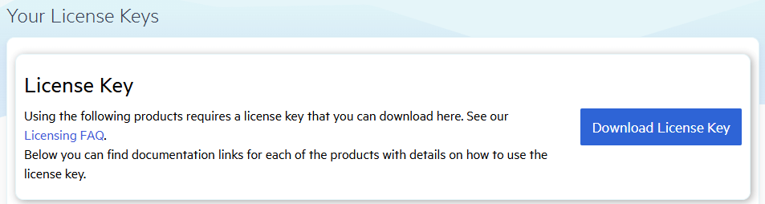

# Introduction

The Telerik JustMock is available in two versions: the commercial version [Telerik JustMock](https://www.telerik.com/products/mocking.aspx) and the free version [Telerik JustMock Lite](https://www.telerik.com/justmock/free-mocking). The commercial version includes a **30-day free trial** that provides access to the full set of features. During the trial period, you also receive full technical support to address any questions or issues. To start your free 30-day trial, visit [this page](https://www.telerik.com/try/justmock).

* To use all the features provided by the commercial version of Telerik JustMock, you need to purchase a license. The terms of use are fully described in the [Telerik JustMock License Agreement](https://www.telerik.com/purchase/license-agreement/justmock-dlw-s). For more information about the available subscription plans, visit the [Telerik JustMock purchase page](https://www.telerik.com/purchase/individual-justmock.aspx).

* Telerik JustMock Lite is available without a subscription. You can review the terms of use for this version in the [Telerik JustMock Free Edition License Agreement](https://www.telerik.com/purchase/license-agreement/justmock-free-edition).

* For a detailed comparison of the features available in the commercial and free versions of Telerik JustMock, see the [Commercial vs Free Version]() section.

# Setting Up Your Telerik JustMock License Key

Starting with the Q2 2025 release, the Telerik JustMock library require activation through a license key (trial or commercial). This article describes how to download your personal license key and use it to activate the Telerik JustMock.

If your license is invalid, you may encounter [errors and warnings]() while running your tests.

## Downloading the License Key

To download a Telerik JustMock license key, ensure you have either a developer license or a trial license. Follow the steps below to obtain your license key.

1. Go to the [License Keys](https://www.telerik.com/account/your-licenses/license-keys) page in your Telerik account.

1. Click the **Download License Key** button.

    

## Activating the Telerik JustMock License

To activate the Telerik JustMock license:

* Copy the [downloaded](#downloading-the-license-key) `telerik-license.txt` license key file to your home directory. This makes the license key available to all projects that you develop on your computer:

    * For Windows: `%AppData%\Telerik\telerik-license.txt`.
    * For macOS/Linux: `${HOME}/.telerik/telerik-license.txt`.

    Before placing the `telerik-license.txt` file in your home directory, ensure the necessary folder structure exists. Create any required directories in your home folder if they do not already exist.
    
## Updating Your License Key

Whenever you purchase a new Telerik JustMock license or renew an existing one, always [download a new license key](#downloading-the-license-key). The new license key includes information about all previous license purchases. This process is referred to as a license key update. Once you have the new license key, use it to [activate the Telerik JustMock](#activating-the-telerik-justmock-license).

> **Tip!**
>
>Windows users can take advantage of the [Progress Control Panel]() for a more streamlined experience.

## See Also

* [License Activation Errors and Warnings]()
* [Adding the License Key to CI Services]()
* [Frequently Asked Questions about Your Telerik JustMock License Key]()
